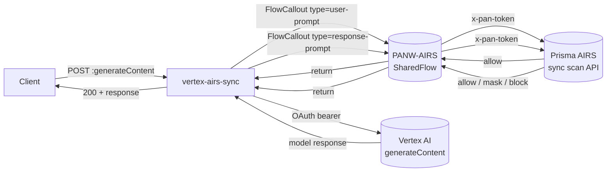
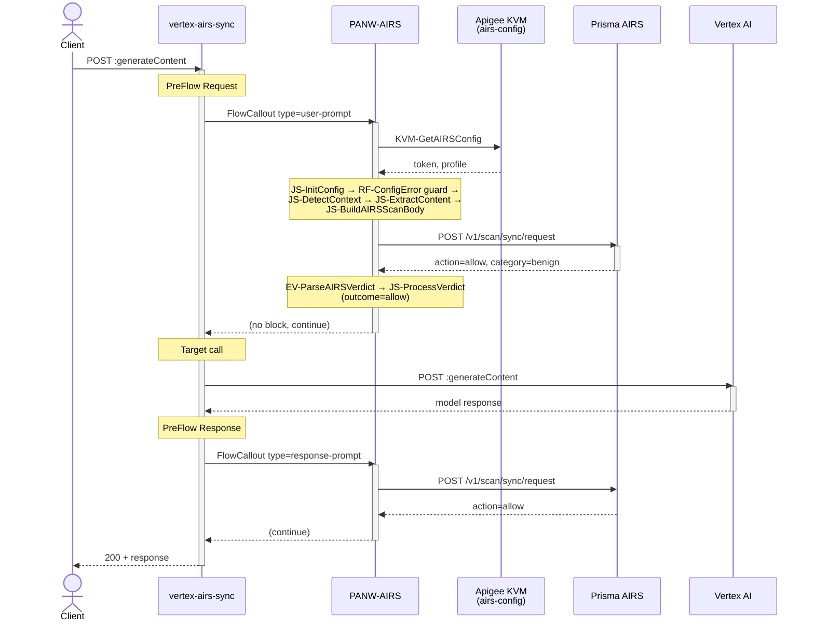
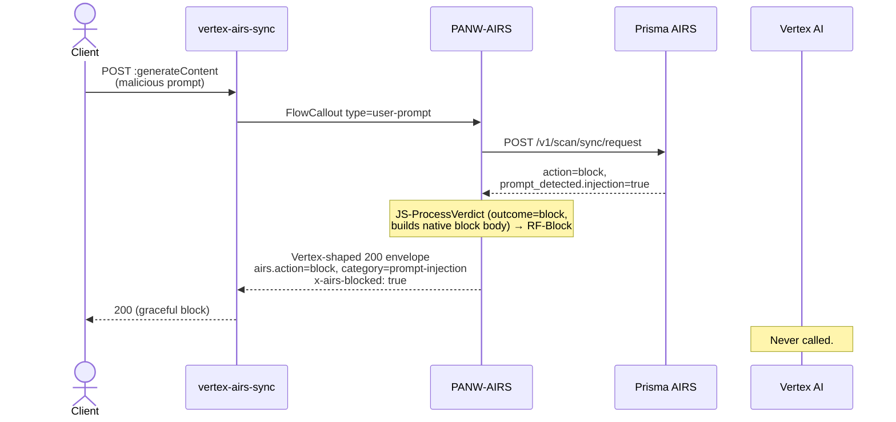
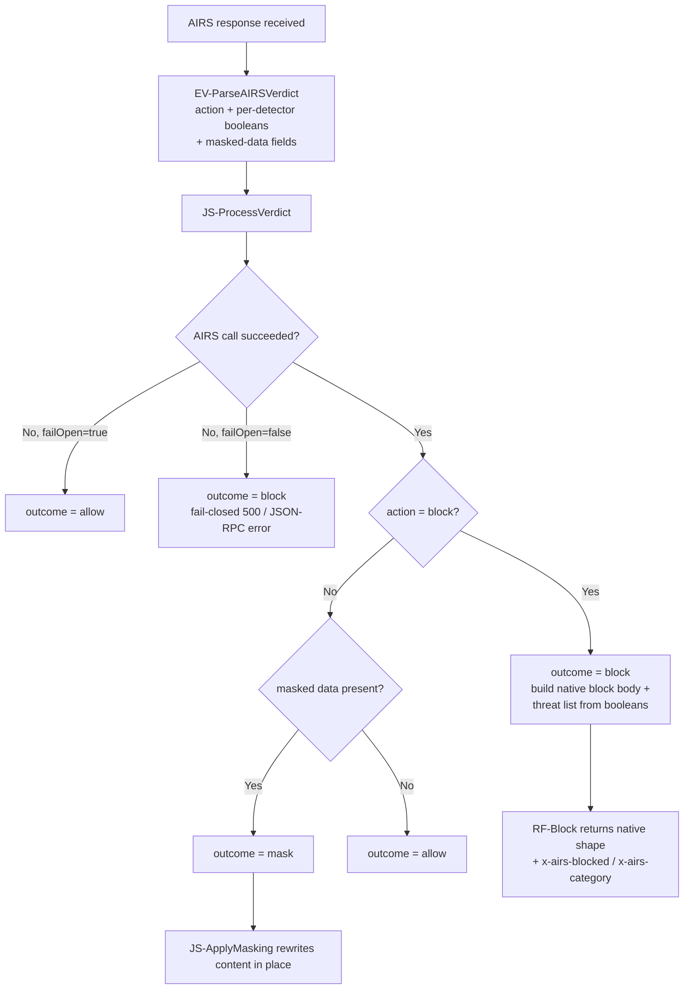
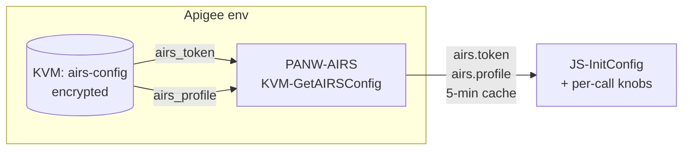

# Architecture — Apigee X + Prisma AIRS SharedFlow Reference

This document explains *how* and *why* the bundles in this folder are shaped the way they are. Read [`README.md`](README.md) first for the operator's view.

## 1. Big picture

Three Apigee bundles cooperate at runtime:

- **`PANW-AIRS`** — a Shared Flow. A self-contained, **provider-agnostic** AIRS-call library. The same steps run on both the request and response legs; a `type` parameter (`user-prompt` / `response-prompt` / `both`) and the auto-detected API shape decide what gets scanned. It reads the AIRS token + profile from KVM, normalises its knobs, detects the API type (OpenAI chat, OpenAI Responses, Anthropic, Gemini/Vertex, or MCP) and whether the caller is Claude Code, extracts the content to scan (including inline tool calls and streamed SSE), calls the AIRS sync API, and turns the verdict into an outcome of **allow / mask / block** — returning a block in the caller's own native dialect.
- **`vertex-airs-sync`** — the shipped example API Proxy. Thin. It fronts Vertex AI `generateContent`, invokes the Shared Flow on the request leg (`type=user-prompt`), routes the allowed request to Vertex, then invokes the Shared Flow again on the response leg (`type=response-prompt`).
- **`experimental/vertex-airs-stream`** — a work-in-progress proxy that scans Vertex `streamGenerateContent` **per SSE event, mid-stream** (see §8). Not deployed by `deploy.sh`.



When AIRS returns `action: block`, the Shared Flow builds a **native, format-appropriate block** carrying the block message + an `airs` verdict object — the request never reaches the model (or, on the response side, the model output never reaches the client). When AIRS instead returns *masked* data, the Shared Flow rewrites the content in place and lets the traffic through.

## 2. Why a Shared Flow at all

The sibling monolithic proxy bakes AIRS-scanning policies directly into the proxy bundle. That works fine for a single LLM proxy. It breaks down when you have **multiple** proxies — say, one per model, or proxies fronting Anthropic and OpenAI alongside Vertex — that all need the same AIRS scanning posture.

A Shared Flow lets you:

- **Edit once, redeploy everywhere.** Token rotation, profile changes, tuning the extractor, swapping the AIRS endpoint region — one edit to `PANW-AIRS`, every proxy that calls it picks up the change.
- **Keep proxies thin.** A proxy in this pattern does exactly two things: route to the LLM and invoke the Shared Flow with a `type`. It does **not** have to extract prompts — the Shared Flow parses `request.content` / `response.content` itself for every supported dialect, so the caller only passes the body through.
- **Reuse across providers.** The Shared Flow detects the API shape from the body and path (OpenAI chat/Responses, Anthropic, Gemini/Vertex, MCP). Any proxy fronting one of those can invoke it unchanged.

Trade-off: there's one more entity to import and deploy. `deploy.sh` handles that, and it's a one-time cost per environment.

## 3. The request lifecycle

The Shared Flow's step order (from [`sharedflows/default.xml`](PANW-AIRS/sharedflowbundle/sharedflows/default.xml)) is the pipeline. Steps after detection are gated on `airs.shouldScan` / `airs.hasContent`, so the flow is a clean no-op when there's nothing to scan:



Two AIRS calls per request — one on the prompt, one on the response. Each round-trips ~50–150 ms.

### The block path



The Vertex target is never invoked. Same shape on the response side, except the model has already been called and burned tokens — but the response never reaches the client.

## 4. Content extraction (the heart of the flow)

`JS-DetectContext` classifies the request into `airs.apiType` (`llm` | `gemini` | `mcp` | `unknown`) from the verb, body, and path, and decides `airs.shouldScan` for the current phase. `JS-ExtractContent` then turns a request/response of **any** supported shape into the plain text AIRS scans. See [`extract-content.js`](PANW-AIRS/sharedflowbundle/resources/jsc/extract-content.js).

Two deliberate design points, both learned from earlier tool-call work:

1. **Per-turn isolation.** The flow scans the **newest** turn's content, not a re-flatten of the whole conversation. Prior turns were scanned when they were new; re-concatenating them muddies attribution (a benign prompt blended with a poisoned tool result) and re-bills already-scanned tokens.
2. **Inline tool-call scanning.** When a model emits a native function call it is not skipped — its argument *values* are folded into the response scan. Symmetrically, inbound tool results are scanned as untrusted input. Values are extracted with a recursive "clean values" collector (`airsCollect`) that pushes scalar strings/numbers and drops keys, braces, and punctuation — feeding AIRS natural language rather than a JSON blob (a JSON wrapper reads as "code" and false-positives benign calls).

| API type | Prompt leg (request) | Response leg |
|---|---|---|
| **Gemini / Vertex** | newest `contents[].parts[].text`; inbound `functionResponse` values folded as untrusted input | model text; inline `functionCall` arg values folded; handles single JSON, streamed JSON array, and SSE |
| **OpenAI Chat Completions** | newest `messages[]` user text; trailing `tool` message / `tool_result` folded as untrusted input | `choices[].message.content`; `tool_calls[].function.arguments` values folded; SSE reassembled (incl. accumulated streamed tool args) |
| **OpenAI Responses API** | newest `input[]` user text | `output[]` `output_text`; `function_call.arguments` values folded; SSE reassembled |
| **Anthropic Messages** | newest `messages[]` user text / `text` blocks; `tool_result` blocks folded as untrusted input | `content[]` `text`; `tool_use.input` values folded; SSE reassembled |
| **MCP (JSON-RPC `tools/call`)** | tool **input** (`params.arguments`) as a `tool_event` — scanned **before** the tool server runs | tool **output** (`result.content` text) added to the same `tool_event`; JSON or single-line SSE |

Folding of tool inputs/results is gated by the `scanTools` knob (default `true`). MCP tool events are scanned against `toolProfile` (default = the main profile). Requests that can't be classified (`apiType == unknown`, e.g. a `count-tokens` utility call) pass through unscanned by default, or are refused with a `403` when `failClosedOnUnknown=true`.

## 5. Claude Code awareness

Claude Code injects `<system-reminder>…</system-reminder>` blocks (harness context, not user intent) into user turns, and makes small background utility calls (title / recap / suggestion generation). Left alone, the scaffolding gets scanned as user input and trips the injection detector, and the background calls waste scans.

`JS-DetectContext` flags a request as Claude Code from the `x-claude-code-session-id` header, `x-app: cli`, or the explicit `forceClaudeCode` knob (needed for Claude-on-Vertex `:rawPredict`, which sends no such headers). When flagged, the extractor:

- **Strips `<system-reminder>` blocks from USER text only** (`airsStripReminders`) — never from tool results or model output, which must reach the scanner byte-for-byte.
- **Skips background utility calls** — toolless turns, tiny `max_tokens` (≤4096), or a `[SUGGESTION MODE:` marker on the newest user message (checked on the last *user* message, never a tool result, so poisoned tool output can't fake a skip).
- **Leaves local tool chatter to the MCP chokepoint** — Anthropic `tool_result` / OpenAI `tool` folding is skipped for Claude Code, since local tool traffic is covered where the MCP server is fronted.

`forceClaudeCode` must only be set on a proxy dedicated to fronting Claude Code — a general-purpose proxy that trusted `<system-reminder>` stripping would let an attacker hide a payload inside a fake reminder.

## 6. The AIRS two-tier verdict and consolidated processing

AIRS returns a two-tier verdict:

```json
{
  "action": "block",
  "category": "malicious",
  "prompt_detected": { "injection": true, "dlp": false, "url_cats": false, "toxic_content": false, "agent": false },
  "response_detected": { },
  "scan_id": "..."
}
```

- **`action`** is the high-level outcome: `allow` or `block`.
- **`category`** is a binary umbrella: `benign` or `malicious`. Naïvely you'd expect this to name the detector — it does not.
- **The detector names live inside `prompt_detected.*`, `response_detected.*`, and (for MCP) `tool_detected.summary.detections.*`** as booleans. Masked-data payloads arrive in `prompt_masked_data` / `response_masked_data` / the tool `detection_entries[].masked_data`.

`EV-ParseAIRSVerdict` extracts all of these into canonical `airs.*` flow variables (the same declarative signals V1 exposed, extended for V2 with the DLP masked-data and MCP tool fields). A single **`JS-ProcessVerdict`** step then consumes them and decides the outcome — replacing V1's chain of fixed per-detector RaiseFaults:



The per-detector booleans still drive a human-readable threat list (preserving V1's "name the detector" behaviour), and set the `x-airs-category` header. The block **body** is built in the caller's own dialect:

- **Vertex / Gemini** — a `candidates[]` envelope + an `airs` object.
- **OpenAI Chat Completions** — a `chat.completion` object + `airs`.
- **OpenAI Responses API** — a `response` object + `airs`.
- **Anthropic Messages** — a `message` object + `airs`.
- **MCP** — a JSON-RPC error (`code -32000`).
- **Any of the above, streaming** — a native SSE refusal so the client's stream parser (incl. Claude Code) completes cleanly instead of erroring.

By default a block is returned with HTTP `200` (an `x-airs-blocked: true` header makes it detectable even in native-200 shape), matching V1's "graceful block" posture — AIRS has already logged/enforced the block; this only controls how the caller is told. The `blockStatus` knob can force a hard status (e.g. `403`) on **non-streaming** blocks so they show up in status-code metrics; SSE blocks always stay `200` because a stream needs it.

## 7. DLP masking (mask-in-place)

Masking is a distinct outcome from blocking. When the AIRS profile is set to mask rather than block, AIRS **allows** the traffic but returns the sanitised text in a `*_masked_data.data` field. `JS-ApplyMasking` (see [`apply-masking.js`](PANW-AIRS/sharedflowbundle/resources/jsc/apply-masking.js)) then rewrites the message in place so sensitive values never reach the model (prompt leg) or the caller (response leg / MCP tool output):

- **Prompt leg** → rewrite `request.content` with `airs.prompt.masked`.
- **Response / both leg** → rewrite `response.content` with `airs.response.masked`.
- **MCP** → rewrite the tool output with `airs.tool.output.masked`.

Every branch is defensive: on any parse failure the original body is left untouched (masking is best-effort; it must never corrupt traffic). For streamed responses the masked value is delivered **exactly once** — the first text-bearing delta carries it and subsequent deltas are blanked, while terminal snapshot events (which carry the full text) get the full masked value. This deliberately avoids the naïve "set every chunk to the full masked string" bug that repeats the value N times.

## 8. JSON-safe scan body

A subtle bug in early iterations: the AIRS scan body was built with Apigee `AssignMessage` interpolation, so any `"` or `\n` in the model output broke the JSON and AIRS returned `400` on perfectly normal outputs.

The fix is in [`build-airs-scan-body.js`](PANW-AIRS/sharedflowbundle/resources/jsc/build-airs-scan-body.js): build the body in JavaScript with `JSON.stringify`, assign the whole thing to `airsScanRequestBody`, then `<Payload>{airsScanRequestBody}</Payload>` at the message level in `AM-SetAIRSScanRequest`. `JSON.stringify` handles all escaping natively.

The same file assembles the `contents` array by **phase and apiType**: `prompt` → `contents[0].prompt`, `response` → `contents[0].response`, `both` → both keys in one object, and MCP → a `tool_event` object. It also sets the correlation identifiers:

- **`transaction_id`** — proven live (Apigee debug trace): the deployed AIRS API reads the client transaction id from `transaction_id` and echoes it back. The `tr_id` field the Python SDK documents is **not** honored by the live API (a scan sent with only `tr_id` came back with a server-minted `pan_`-prefixed id). Sourced from the `x-request-id` header or Apigee's `messageid`.
- **`session_id`** — groups a conversation and is echoed back verbatim. Derived from the Claude Code / `x-session-id` / MCP session header, an OpenAI `previous_response_id`, or a stable SHA-256 hash of client IP + system + first user message, falling back to `messageid`.
- **`metadata`** — `app_name` = `Apigee-<appName>` (house rule `<VENDOR>-<CUSTOMER_APP>`; default `Apigee-Gateway`), plus `user_ip`, `ai_model`, `app_user`, and optional `agent_meta`.

## 9. Configuration model

The Shared Flow has exactly one hard dependency on its caller's environment: an Apigee KVM named `airs-config` with two encrypted entries. Everything else is optional per-call flow variables (see the knob table in [`README.md`](README.md) and [`init-config.js`](PANW-AIRS/sharedflowbundle/resources/jsc/init-config.js)).



- **Why a KVM, not env vars or static config?** Env-scoped, encrypted at rest, rotatable without redeploying any bundle, and inspectable via Apigee's API without exposing the value in logs.
- **Why two keys?** Token and profile are independently rotatable. You can change the profile (e.g. swap a permissive dev profile for a strict prod profile) without touching the token, and vice versa. The KVM profile is a **fallback** — a proxy may override it per request via `currentProfile` / `toolProfile`.
- **Why `airs_token` not `airs.token` (dot notation)?** The Apigee *flow variable* the value is assigned to is `airs.token` (the dot-notation you'd see in Trace); the KVM *key* avoids dots for a cleaner management-API URL path.

`deploy.sh` creates the KVM and upserts both entries via the Apigee management API. `KVM-GetAIRSConfig` reads them with a 5-minute cache TTL so we're not paying KVM lookup latency on every scan.

## 10. Why fail-closed (and how V2 does it cleanly)

The whole point of putting AIRS in line is to guarantee scanning — if scanning isn't happening, the request should not reach the model. A fail-open posture would mean an AIRS outage silently downgrades you to no AI security at all, which is the opposite of what an AI security gateway should do. So the default is **fail-closed** (`failOpen=false`).

V2 implements this without hard-faulting the proxy. `SC-AIRSScan` runs with `continueOnError="true"` and a 5 s `<Timeout>`, so an AIRS timeout or 5xx doesn't throw — instead `JS-ProcessVerdict` sees the non-200 callout status and:

- with `failOpen=false` (default) → sets `outcome=block` and builds a clean fail-closed response (`500` JSON `{ "error": … }`, or a JSON-RPC `-32603` error for MCP);
- with `failOpen=true` → sets `outcome=allow` and lets the traffic through.

Separately, if the AIRS **token is missing from KVM** entirely, `RF-ConfigError` fires up front (a clear `500`) before any scan is attempted — unless `failOpen=true`, in which case the step is skipped and the scan simply fails open downstream.

The cost of fail-closed is that AIRS becomes a hard runtime dependency. If you can't accept that, the right answer is to architect for AIRS availability (multi-region failover, redundant deploy profiles) rather than to fall back to bypass.

## 11. The streaming bundle (experimental)

The Shared Flow already handles **streamed SSE responses** for the sync proxies: `response.content` is the gateway-buffered stream, which the extractor reassembles (OpenAI, Anthropic, OpenAI Responses, Gemini) and the verdict/masking steps turn into a native SSE block or an in-stream mask. That is a *post-buffer* scan — the full streamed body is scanned once it is available at the gateway.

The proxy under [`experimental/vertex-airs-stream/`](experimental/vertex-airs-stream/) attempts something harder: scanning Vertex `streamGenerateContent` **per SSE event, mid-stream**, so a block can fire before the whole response has streamed. Apigee's `FlowCallout` does not work inside an EventFlow, so it can't reuse the Shared Flow for the response leg; instead an inline JavaScript (`airs-scan-event.js`) calls AIRS directly via Rhino's `httpClient.send()`, with a cumulative buffer (200-char threshold), a sticky `airs.stream.blocked` flag, and a fallback chain across Apigee Rhino runtime variants.

In our lab the happy path renders and mid-stream blocks fire, but we've seen inconsistent results we don't yet trust — partial events being scanned, intermittent silent passes, model- and prompt-dependent behaviour. Until we can characterise and fix those, the streaming bundle is checked in as a starting point for collaboration, not a working reference. See its [README](experimental/vertex-airs-stream/README.md) for current status.

## 12. Testing

The bundle's JavaScript brains are covered by hermetic, offline unit tests in [`test/run-unit.js`](PANW-AIRS/test/run-unit.js):

```bash
node test/run-unit.js      # → ✓ ALL PASS:  45 passed, 0 failed
```

The tests load the real `.js` resources into a sandbox that emulates Apigee's JavaScript policy contract (a shared `context` variable store, the `<IncludeURL>` lib, and a `crypto` object), emulate the live AIRS call and the `EV-ParseAIRSVerdict` JSONPath parse, then drive the pipeline with fixtures for every supported shape. They validate two things without any cloud: **extraction** (the scan body that would be sent) and **verdict** (the outcome + native block body for a given AIRS reply). The Apigee policies themselves are exercised live once the Shared Flow is deployed.

## 13. Extending this

A few directions this pattern naturally grows in:

- **More proxies.** Add `anthropic-airs-sync/` or `openai-airs-sync/` proxy bundles alongside `vertex-airs-sync/`. They all `FlowCallout` into the same `PANW-AIRS` Shared Flow with a `type` parameter; the multi-format extractor already understands their bodies, so no Shared Flow change is needed.
- **Per-route AIRS profiles.** Set `currentProfile` / `toolProfile` as flow variables before the FlowCallout to run a single Shared Flow with different posture per consumer, per model, or per tool.
- **Tighter tool-call control.** The MCP chokepoint scans tool input pre-execution and output post-execution; inline function-call scanning covers native LLM tool calling. Custom detector-to-message mappings can be supplied via the `airsDescriptions` knob.
- **Streaming, mid-stream.** Once the experimental per-event proxy settles, promote it out of `experimental/` and add it to `deploy.sh`.
