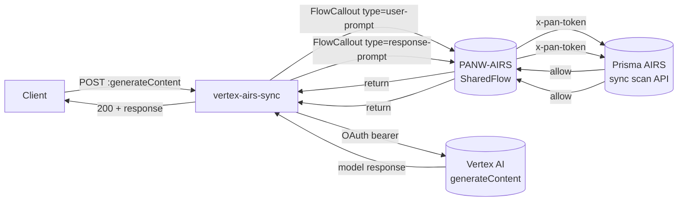
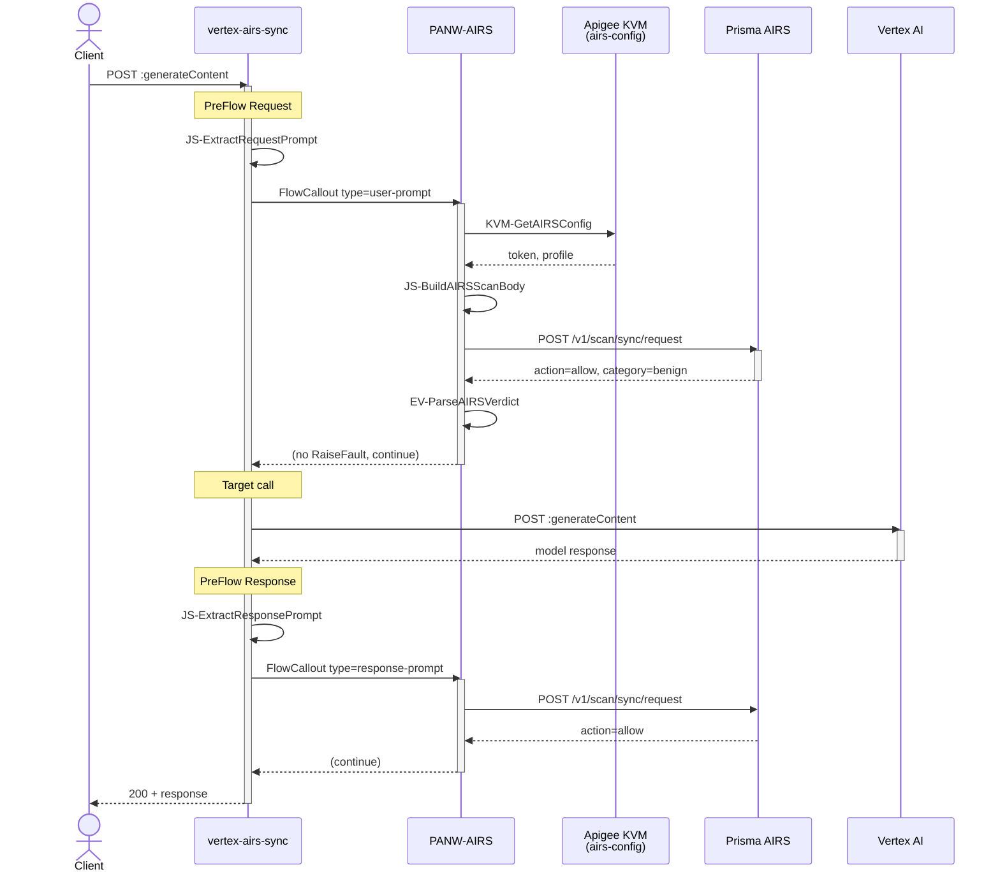
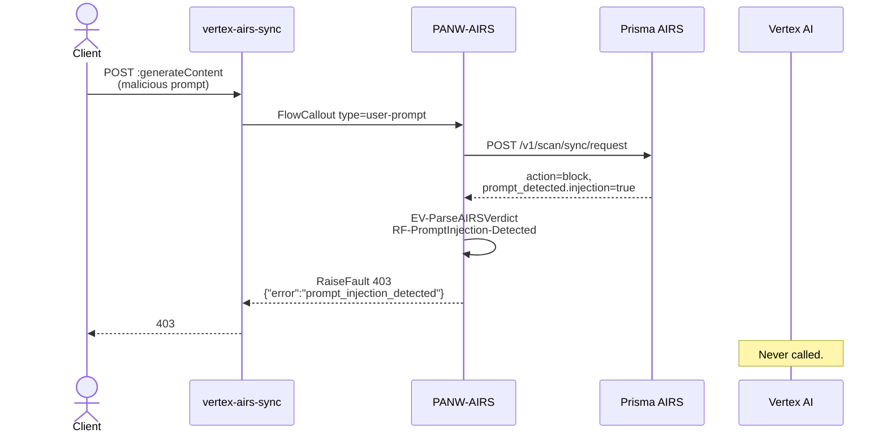
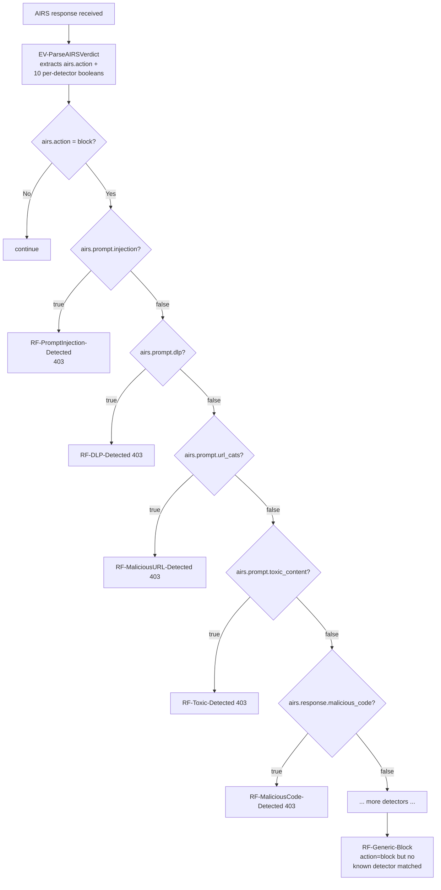
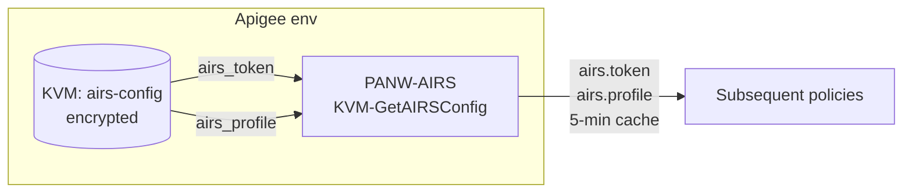

# Architecture — Apigee X + Vertex AI + Prisma AIRS SharedFlow Reference

This document explains *how* and *why* the bundles in this folder are shaped the way they are. Read [`README.md`](README.md) first for the operator's view.

## 1. Big picture

Three Apigee bundles cooperate at runtime:

- **`PANW-AIRS`** — a Shared Flow. Self-contained AIRS-call library. Takes a `type` parameter (`user-prompt` or `response-prompt`), reads the AIRS token + profile from KVM, builds a scan request, calls the AIRS sync API, parses the verdict, and raises a detector-specific `403` when AIRS says block.
- **`vertex-airs-sync`** — the API Proxy. Thin. Extracts the prompt out of the Vertex request, invokes the Shared Flow, routes the (allowed) request to Vertex, then invokes the Shared Flow again on the response.
- **`experimental/vertex-airs-stream`** — work-in-progress streaming SSE proxy. Same pattern but with response-side scanning happening inside an EventFlow. Not deployed by `deploy.sh`.



When AIRS returns `action: block`, the SharedFlow inspects which per-detector boolean fired and raises a matching `403` — the request never reaches Vertex (or, on the response side, the model output never reaches the client).

## 2. Why a Shared Flow at all

The sibling monolithic proxy bakes AIRS-scanning policies directly into the proxy bundle. That works fine for a single LLM proxy. It breaks down when you have **multiple** proxies — say, one per Vertex model, or proxies fronting Anthropic and OpenAI alongside Vertex — that all need the same AIRS scanning posture.

A Shared Flow lets you:

- **Edit once, redeploy everywhere.** Token rotation, profile changes, adding a new detector RaiseFault, swapping the AIRS endpoint region — one edit to `PANW-AIRS`, every proxy that calls it picks up the change immediately.
- **Keep proxies thin.** The proxies in this pattern do exactly two things: marshal the prompt and route to the LLM. They are the same shape regardless of which LLM you're fronting.
- **Reuse across non-Vertex LLMs.** The Shared Flow knows nothing about Vertex. Any proxy that can populate a `request_prompt_value` or `response_prompt_value` flow variable can invoke it.

Trade-off: there's one more entity to import and deploy. `deploy.sh` handles that, and it's a one-time cost per environment.

## 3. The sync request lifecycle



Two AIRS calls per request — one on the prompt, one on the response. Each round-trips ~50–150 ms.

### The block path



The Vertex target is never invoked. Same shape on the response side, except the model has already been called and burned tokens — but the response never reaches the client.

## 4. The AIRS two-tier verdict

This was a subtlety that cost real time to discover. AIRS returns:

```json
{
  "action": "block",
  "category": "malicious",
  "prompt_detected": {
    "injection": true,
    "dlp": false,
    "url_cats": false,
    "toxic_content": false
  },
  "response_detected": { },
  "scan_id": "..."
}
```

- **`action`** is the high-level outcome: `allow` or `block`.
- **`category`** is binary umbrella: `benign` or `malicious`. Naïvely you'd expect this to name the detector — it does not.
- **The detector names live inside `prompt_detected.*` and `response_detected.*`** as booleans.

So a correct implementation has to:

1. Read `action` — if `allow`, continue.
2. Otherwise inspect each per-detector boolean to know **which** detector tripped.
3. Raise a detector-specific `403` so the client knows what to fix.

The `EV-ParseAIRSVerdict` policy in the Shared Flow extracts all ten booleans into flow variables (`airs.prompt.injection`, `airs.prompt.dlp`, `airs.prompt.url_cats`, `airs.prompt.toxic_content`, `airs.response.dlp`, `airs.response.url_cats`, `airs.response.malicious_code`, `airs.response.toxic_content`, `airs.response.db_security`, `airs.response.ungrounded`). The `sharedflows/default.xml` then has a series of conditional `<Step>` entries — one per detector — that fire the matching RaiseFault.



The `RF-Generic-Block` at the end is a defensive net — if AIRS introduces a new detector we haven't mapped yet, the client still gets a `403` instead of silently allowed traffic.

## 5. JSON-safe scan body

A subtle bug in early iterations: the AIRS scan body was built with Apigee `AssignMessage` interpolation:

```xml
<Payload>{"contents":[{"response":"{response_prompt_value}"}]}</Payload>
```

Any `"` or `\n` in the model output broke the JSON — AIRS returned `400`, the SharedFlow raised `503`, the client got a confusing error on perfectly normal model outputs.

The fix is in [`PANW-AIRS/sharedflowbundle/resources/jsc/build-airs-scan-body.js`](PANW-AIRS/sharedflowbundle/resources/jsc/build-airs-scan-body.js): build the body in JavaScript with `JSON.stringify`, assign the whole thing to a flow variable, then `<Payload>{airsScanRequestBody}</Payload>` at the message level. `JSON.stringify` handles all the escaping rules natively.

The same JS file branches on `type` — `user-prompt` populates `contents[0].prompt`, `response-prompt` populates `contents[0].response`. One file, both call sites.

## 6. Configuration model

The Shared Flow has exactly one dependency on its caller's environment: an Apigee KVM named `airs-config` with two encrypted entries.



- **Why a KVM, not env vars or static config?** Env-scoped, encrypted at rest, rotatable without redeploying any bundle, and inspectable via Apigee's API without exposing the value in logs.
- **Why two keys?** Token and profile are independently rotatable. You can change the profile (e.g. swap from a permissive dev profile to a strict prod profile) without touching the token, and vice versa.
- **Why `airs_token` not `airs.token` (dot notation)?** Apigee KVM keys can contain dots, but the underlying URL path component for the management API is cleaner without them. The Apigee *flow variable* the value gets assigned to is `airs.token` — that's the dot-notation you'd see in Trace.

`deploy.sh` creates the KVM and upserts both entries via the Apigee management API. The Shared Flow's `KVM-GetAIRSConfig` policy reads them with a 5-minute cache TTL so we're not paying KVM lookup latency on every scan.

## 7. Why fail-closed

`SC-AIRSScan.xml` has `IgnoreError="false"` and `ContinueOnError="false"`. If AIRS is unreachable, slow (>5 s), or returns 5xx, the Shared Flow raises a `503` and the request is rejected.

This is deliberate. The whole point of putting AIRS in line is to guarantee scanning — if scanning isn't happening, the request should not reach Vertex. A fail-open posture would mean an AIRS outage silently downgrades you to no AI security at all, which is the opposite of what an AI security gateway should do.

The cost of fail-closed is that AIRS becomes a hard runtime dependency. If you can't accept that, the right answer is to architect for AIRS availability (multi-region failover, redundant deploy profiles) rather than to fall back to bypass.

## 8. The streaming bundle (experimental)

The streaming proxy under [`experimental/vertex-airs-stream/`](experimental/vertex-airs-stream/) attempts the same posture against `:streamGenerateContent`. The user-prompt scan reuses the Shared Flow — that part works the same way as sync, because it happens before streaming starts.

The response-side scan is where it gets hard. Apigee's `FlowCallout` policy does not work inside an EventFlow (the per-SSE-event handler), so the response scan can't reuse the Shared Flow. Instead, an inline JavaScript (`airs-scan-event.js`) calls AIRS directly via Rhino's `httpClient.send()`, with:

- A cumulative buffer (200-character threshold) so we're not paying a scan round-trip per token.
- A sticky `airs.stream.blocked` flag — once any chunk's scan blocks, subsequent chunks are muted.
- A fallback chain across Apigee Rhino runtime variants (`resp.content.asString` → `String(resp.content)` → `resp.body` → `String(resp)`).

In our lab the happy path renders and mid-stream blocks fire, but we've seen inconsistent results we don't yet trust — partial events being scanned, intermittent silent passes, model- and prompt-dependent behavior. Until we can characterize and fix those, the streaming bundle is checked in as a starting point for collaboration, not as a working reference. See its [README](experimental/vertex-airs-stream/README.md) for current status.

## 9. Extending this

A few directions this pattern naturally grows in:

- **Multi-LLM fan-out.** Add `anthropic-airs-sync/` or `openai-airs-sync/` proxy bundles alongside `vertex-airs-sync/`. They all `FlowCallout` into the same `PANW-AIRS` Shared Flow. AIRS-side logic stays in one place.
- **Per-route AIRS profiles.** Pass a second `Parameter` to the FlowCallout (e.g. `<Parameter name="profile_override">strict-prod</Parameter>`) and have the Shared Flow prefer that over the KVM value. Lets you run a single bundle with different posture per consumer or per model.
- **Tool-call interception.** If/when AIRS supports scanning function-call arguments, add a third `type` (`tool-call`) and a corresponding RaiseFault. The current Shared Flow shape extends naturally — the `JS-BuildAIRSScanBody` branch on `type` is the seam to extend.
- **Streaming, properly.** Once the streaming bundle settles, promote it out of `experimental/` and add it to `deploy.sh`. The cleanest path forward is probably a smaller buffer threshold + tighter `httpClient` timeout + explicit Rhino version pinning.
