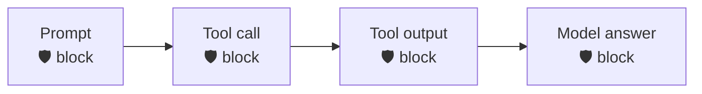

<div align="center">

# 🛡️ Codex × Prisma AIRS

**Scan every checkpoint of Codex — prompt, tool call, tool output, and final answer — through [Prisma AIRS](https://pan.dev/prisma-airs/).**


&nbsp;<a href="../README.md">↩ all agents</a>

</div>

## Quick start

**1 · Copy the `.codex/` folder into your Codex project** — pick the runtime you have:
```bash
cp -r nodejs/.codex  /path/to/your/project/      # or  bash/.codex  ·  powershell/.codex
```

**2 · Set your Prisma AIRS credentials**
```bash
export PRISMA_AIRS_API_KEY="your-api-key"
export PRISMA_AIRS_PROFILE_NAME="your-profile"
```

> [!IMPORTANT]
> **Configure before you rely on it.** With **no `PRISMA_AIRS_API_KEY`** set, a fresh install **passes traffic through unscanned** and prints a loud `NOT CONFIGURED` warning on every call — so copying the folder in won't brick Codex, but you are **not protected** until credentials land. Once a key **is** set, any AIRS error (or a half-config with a key but no profile) fails **closed** on the input side.

> [!WARNING]
> **In production, set `AIRS_REQUIRE_CONFIG=1`.** Codex is an env-writer (it has file/shell tools), so an injected instruction could delete this install's `.env` — a benign-looking file op AIRS won't flag — to *force* the unconfigured state and silently bypass scanning. `AIRS_REQUIRE_CONFIG=1` makes that fail **closed** (a loud DoS, not a bypass). Also deny the agent write access to the hooks dir. See [SECURITY.md](../SECURITY.md).

**3 · Start Codex — done.** Every checkpoint below is now scanned.

## Choose your runtime

| Runtime | Requires | Best for |
|:--|:--|:--|
| [`nodejs/`](nodejs/) | Node 18+ · zero deps | Full engine — DLP mask-in-place + chunking |
| [`bash/`](bash/) | `jq` + `curl` | macOS / Linux |
| [`powershell/`](powershell/) | PowerShell 5.1+ / 7 · no `jq`/`curl` | Windows-native |

Each folder is self-contained (engine + wiring + `.codex/`). Shared `example.env` documents every variable; `tests/` runs the same fixtures against all three runtimes.

## Coverage

| Prompt | Response | Streaming | Pre-tool | Post-tool |
|:--:|:--:|:--:|:--:|:--:|
| ✅ | ✅ | ❌ | ✅ | ✅ |

<div align="center"><sub>✅ hard-block &nbsp;·&nbsp; ⚠️ scan + alert / redact &nbsp;·&nbsp; ❌ no usable surface in the hook contract</sub></div>

> [!WARNING]
> **Codex enforcement is contract-derived — not yet validated on a live Codex CLI.** The ✅ marks reflect the engine emitting Codex's documented block wire format (exit 2 via `.codex/hooks.json`), but the hard-block has **not** been confirmed end-to-end against a real Codex client, and Codex's docs on its deny mechanism are ambiguous (several Claude-style fields are documented as accepted-but-fail-open). Treat **pre-tool hard-block as pending live validation**; confirm with `tests/run-tests.sh live` against a real Codex session before relying on it.


<details>
<summary><b>How enforcement works in Codex</b></summary>

<br>

Codex CLI reads hooks from `.codex/hooks.json` on the Claude-compatible contract: the engine scans the prompt on input, the model's answer on `Stop`, and tool input/output as a `tool_event` (`tools/call`) for **indirect prompt injection**, and renders a block as **exit code 2** on `PreToolUse`. **Caveat — pending live validation:** this hard-block is **contract-derived, not yet verified against a live Codex CLI**, and Codex's own docs on which deny fields it honors are ambiguous (some Claude-style fields are documented as accepted-but-fail-open). Until a live Codex block is confirmed (`tests/run-tests.sh live`), treat pre-tool enforcement as unproven.
</details>

<div align="center">
<br>
<sub>MIT © 2026 Palo Alto Networks &nbsp;·&nbsp; <a href="../README.md">all agents</a> &nbsp;·&nbsp; <a href="https://pan.dev/prisma-airs/api/airuntimesecurity/usecases/">detection categories</a></sub>
</div>
