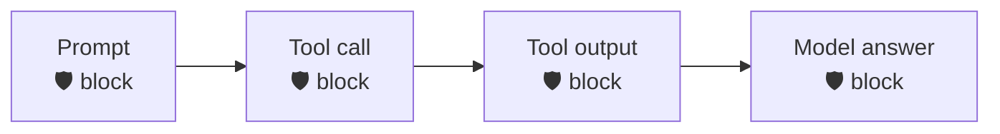

<div align="center">

# 🛡️ Codex × Prisma AIRS

**Scan every checkpoint of Codex — prompt, tool call, tool output, and final answer — through [Prisma AIRS](https://pan.dev/prisma-airs/).**


&nbsp;<a href="../README.md">↩ all agents</a>

</div>

## Quick start

**1 · Copy the `.codex/` folder into your Codex project** — pick the runtime you have:
```bash
cp -r nodejs/.codex  /path/to/your/project/      # or  bash/.codex  ·  powershell/.codex
```

**2 · Set your Prisma AIRS credentials**
```bash
export PRISMA_AIRS_API_KEY="your-api-key"
export PRISMA_AIRS_PROFILE_NAME="your-profile"
```

**3 · Start Codex — done.** Every checkpoint below is now scanned.

## Choose your runtime

| Runtime | Requires | Best for |
|:--|:--|:--|
| [`nodejs/`](nodejs/) | Node 18+ · zero deps | Full engine — DLP mask-in-place + chunking |
| [`bash/`](bash/) | `jq` + `curl` | macOS / Linux |
| [`powershell/`](powershell/) | PowerShell 5.1+ / 7 · no `jq`/`curl` | Windows-native |

Each folder is self-contained (engine + wiring + `.codex/`). Shared `example.env` documents every variable; `tests/` runs the same fixtures against all three runtimes.

## Coverage

| Prompt | Response | Streaming | Pre-tool | Post-tool |
|:--:|:--:|:--:|:--:|:--:|
| ✅ | ✅ | ❌ | ✅ | ✅ |

<div align="center"><sub>✅ hard-block &nbsp;·&nbsp; ⚠️ scan + alert / redact &nbsp;·&nbsp; ❌ no usable surface in the hook contract</sub></div>



<details>
<summary><b>How enforcement works in Codex</b></summary>

<br>

Prompt scanned on input; the model's answer on Stop; tool input/output as `tool_event` (method `tools/call`) so tool results are checked for **indirect prompt injection**, not treated as a plain response.
</details>

<div align="center">
<br>
<sub>MIT © 2026 Palo Alto Networks &nbsp;·&nbsp; <a href="../README.md">all agents</a> &nbsp;·&nbsp; <a href="https://pan.dev/prisma-airs/api/airuntimesecurity/usecases/">detection categories</a></sub>
</div>
