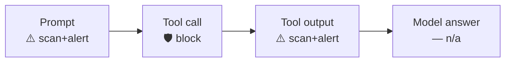

<div align="center">

# 🛡️ Cursor × Prisma AIRS

**Scan every checkpoint of Cursor — prompt, tool call, tool output, and final answer — through [Prisma AIRS](https://pan.dev/prisma-airs/).**


&nbsp;<a href="../README.md">↩ all agents</a>

</div>

## Quick start

**1 · Copy the `.cursor/` folder into your Cursor project** — pick the runtime you have:
```bash
cp -r nodejs/.cursor  /path/to/your/project/      # or  bash/.cursor  ·  powershell/.cursor
```

**2 · Set your Prisma AIRS credentials**
```bash
export PRISMA_AIRS_API_KEY="your-api-key"
export PRISMA_AIRS_PROFILE_NAME="your-profile"
```

**3 · Start Cursor — done.** Every checkpoint below is now scanned.

## Choose your runtime

| Runtime | Requires | Best for |
|:--|:--|:--|
| [`nodejs/`](nodejs/) | Node 18+ · zero deps | Full engine — DLP mask-in-place + chunking |
| [`bash/`](bash/) | `jq` + `curl` | macOS / Linux |
| [`powershell/`](powershell/) | PowerShell 5.1+ / 7 · no `jq`/`curl` | Windows-native |

Each folder is self-contained (engine + wiring + `.cursor/`). Shared `example.env` documents every variable; `tests/` runs the same fixtures against all three runtimes.

## Coverage

| Prompt | Response | Streaming | Pre-tool | Post-tool |
|:--:|:--:|:--:|:--:|:--:|
| ⚠️ | ❌ | ❌ | ✅ | ⚠️ |

<div align="center"><sub>✅ hard-block &nbsp;·&nbsp; ⚠️ scan + alert / redact &nbsp;·&nbsp; ❌ no usable surface in the hook contract</sub></div>



<details>
<summary><b>How enforcement works in Cursor</b></summary>

<br>

Cursor reads hook decisions from **stdout** (there is no fd 3). **Pre-tool** is the hard block: `beforeShellExecution` / `beforeMCPExecution` return `{"permission":"deny"}`. **Post-tool** (`postToolUse`) can't hard-block, but it scans the tool output and — for **MCP tools** — **redacts** the model-visible result (`updated_mcp_tool_output`) plus warns (`additional_context`); non-MCP output can only be warned (Cursor's redaction is MCP-only). `beforeSubmitPrompt` is **advisory** (record-only), and Cursor exposes **no way to block the model's answer** (`afterAgentResponse` doesn't fire in the CLI). Tool input/output is scanned as a `tool_event` (`tools/call`) for **indirect prompt injection**.
</details>

## Correlation IDs

Cursor hands the hook a **`conversation_id`** (stable per conversation) and **no per-turn
id**. In Prisma AIRS terms that `conversation_id` is the **`session_id`** — the
per-conversation slot AIRS stores and lets you query by `scan_id`. The engine maps it
automatically:

- **`session_id`** ← Cursor `conversation_id` → groups the whole conversation in AIRS.
- **`transaction_id`** (per-turn slot) — Cursor exposes no per-turn id, so the engine reuses
  the conversation id (constant across the conversation) unless you export your own; AIRS
  otherwise mints a `pan_…`.

Do **not** map Cursor's id onto the legacy `tr_id`: on the live API `tr_id` is only a
mirror/fallback of `session_id`, never the transaction field. Full guide:
[Correlation IDs](../README.md#correlation-ids--what-to-send) ·
[live findings](../docs/airs-correlation-id-findings.md).

<div align="center">
<br>
<sub>MIT © 2026 Palo Alto Networks &nbsp;·&nbsp; <a href="../README.md">all agents</a> &nbsp;·&nbsp; <a href="https://pan.dev/prisma-airs/api/airuntimesecurity/usecases/">detection categories</a></sub>
</div>
