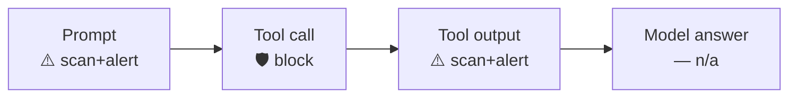

<div align="center">

# 🛡️ Devin × Prisma AIRS

**Scan every checkpoint of Devin — prompt, tool call, tool output, and final answer — through [Prisma AIRS](https://pan.dev/prisma-airs/).**


&nbsp;<a href="../README.md">↩ all agents</a>

</div>

## Quick start

**1 · Copy the `.devin/` folder into your Devin project** — pick the runtime you have:
```bash
cp -r nodejs/.devin  /path/to/your/project/      # or  bash/.devin  ·  powershell/.devin
```

**2 · Set your Prisma AIRS credentials**
```bash
export PRISMA_AIRS_API_KEY="your-api-key"
export PRISMA_AIRS_PROFILE_NAME="your-profile"
```

> [!IMPORTANT]
> **Configure before you rely on it.** With **no `PRISMA_AIRS_API_KEY`** set, a fresh install **passes traffic through unscanned** and prints a loud `NOT CONFIGURED` warning on every call — so copying the folder in won't brick Devin, but you are **not protected** until credentials land. Once a key **is** set, any AIRS error (or a half-config with a key but no profile) fails **closed** on the input side.

> [!WARNING]
> **In production, set `AIRS_REQUIRE_CONFIG=1`.** Devin is an env-writer (it has file/shell tools), so an injected instruction could delete this install's `.env` — a benign-looking file op AIRS won't flag — to *force* the unconfigured state and silently bypass scanning. `AIRS_REQUIRE_CONFIG=1` makes that fail **closed** (a loud DoS, not a bypass). Also deny the agent write access to the hooks dir. See [SECURITY.md](../SECURITY.md).

**3 · Start Devin — done.** Every checkpoint below is now scanned.

## Choose your runtime

| Runtime | Requires | Best for |
|:--|:--|:--|
| [`nodejs/`](nodejs/) | Node 18+ · zero deps | Full engine — DLP mask-in-place + chunking |
| [`bash/`](bash/) | `jq` + `curl` | macOS / Linux |
| [`powershell/`](powershell/) | PowerShell 5.1+ / 7 · no `jq`/`curl` | Windows-native |

Each folder is self-contained (engine + wiring + `.devin/`). Shared `example.env` documents every variable; `tests/` runs the same fixtures against all three runtimes.

## Coverage

| Prompt | Response | Streaming | Pre-tool | Post-tool |
|:--:|:--:|:--:|:--:|:--:|
| ⚠️ | ❌ | ❌ | ✅ | ⚠️ |

<div align="center"><sub>✅ hard-block &nbsp;·&nbsp; ⚠️ scan + alert / redact &nbsp;·&nbsp; ❌ no usable surface in the hook contract</sub></div>




<details>
<summary><b>How enforcement works in Devin</b></summary>

<br>

Devin's CLI hooks speak the Claude contract on **input** (`prompt` / `tool_name` / `tool_input` / `tool_response`), but enforcement is narrower: **`PreToolUse` is the only hard block** (exit 2). `UserPromptSubmit` and `PostToolUse` are **advisory** — scanned, with an alert and injected context, but they cannot stop an action — and **`Stop` carries no final answer or transcript**, so the model's answer is not scanned. Tool input/output is sent as a `tool_event` (`tools/call`) to catch **indirect prompt injection**.
</details>

<div align="center">
<br>
<sub>MIT © 2026 Palo Alto Networks &nbsp;·&nbsp; <a href="../README.md">all agents</a> &nbsp;·&nbsp; <a href="https://pan.dev/prisma-airs/api/airuntimesecurity/usecases/">detection categories</a></sub>
</div>
