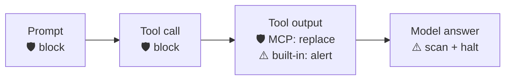

<div align="center">

# 🛡️ Grok Build × Prisma AIRS

**Scan every checkpoint of Grok Build — prompt, tool call, tool output, and final answer — through [Prisma AIRS](https://pan.dev/prisma-airs/).**


&nbsp;<a href="../README.md">↩ all agents</a>

</div>

## Quick start

**1 · Set your Prisma AIRS credentials** — in the environment Grok is launched from:
```bash
export PRISMA_AIRS_API_KEY="your-api-key"
export PRISMA_AIRS_PROFILE_NAME="your-profile"
```

**2 · Copy the contents of `.grok/hooks/` into `~/.grok/hooks/`** — pick the runtime you have:
```bash
mkdir -p ~/.grok/hooks
cp -R nodejs/.grok/hooks/.  ~/.grok/hooks/      # or  bash/.grok/hooks/.  ·  powershell/.grok/hooks/.
```

> [!IMPORTANT]
> **Install globally, into `~/.grok/hooks/`.** Grok always trusts that folder. A project-level `<project>/.grok/hooks/` loads **nothing** until you trust the folder with `/hooks-trust` (or launch with `--trust`), and Grok gives no warning while it is skipped. The shipped wiring also calls the engine by an **absolute** path under `~/.grok/hooks/`, so the global folder is the only supported location.

> [!IMPORTANT]
> **This wiring fails closed from the first run.** Unlike the other agents' folders, the shipped `prisma-airs.json` pins `AIRS_REQUIRE_CONFIG=1` and `AIRS_FAIL_MODE=closed` on every handler. Grok passes a handler's `env` map to the hook, and that map wins over your shell, so a stray `AIRS_FAIL_MODE=open` exported for another agent does not reach these hooks. With **no `PRISMA_AIRS_API_KEY`**, every prompt and tool call is therefore **blocked** until credentials are set. That is why step 1 comes first. Any AIRS error with a key set also fails **closed**, and on Grok that includes the **output side**: MCP output is withheld from the model, a built-in tool result carries a block reason, and Stop ends the turn. Grok never shows a warning from a hook that allows, so a fail-open output would pass without a trace. To allow on AIRS errors instead, set `AIRS_FAIL_MODE` to `open` in `prisma-airs.json`. To go back to the repo-wide loud pass-through while you set up, delete the `AIRS_REQUIRE_CONFIG` entries from `prisma-airs.json`. Put them back before you rely on the hooks. Never put credentials in the `env` map. See [SECURITY.md](../SECURITY.md).

**3 · Start Grok and check the hooks loaded.** Run `/hooks` (or, outside VS Code-family terminals, press `Ctrl+L` and switch to the **Hooks** tab) and confirm the four `prisma-airs` hooks appear under **Global**. Every checkpoint below is now scanned.

> [!WARNING]
> **Existing Claude Code or Cursor hooks fire inside Grok too, so every event is scanned twice.** Grok also loads hooks from `~/.claude/settings.json` and `~/.cursor/hooks.json` (always trusted), and from a trusted project's `.claude/settings.json` / `.cursor/hooks.json`. If the [Claude Code](../ClaudeCode/) or [Cursor](../Cursor/) AIRS hooks are installed there, they run next to these hooks. Grok's snake_case aliases let the Claude Code hooks scan the prompt, tool call and tool output a second time, but they miss the final answer and cannot replace MCP output. The result is duplicate AIRS calls and latency with nothing gained. Once this install is in place, switch that compatibility loading off in `~/.grok/config.toml`:
> ```toml
> [compat.claude]
> hooks = false     # stop loading ~/.claude/settings.json hooks in Grok
>
> [compat.cursor]
> hooks = false     # stop loading ~/.cursor/hooks.json hooks in Grok
> ```
> The same switches exist as `GROK_CLAUDE_HOOKS_ENABLED` / `GROK_CURSOR_HOOKS_ENABLED`. They turn off **every** hook Grok would load from those files, not only the AIRS ones. Claude Code and Cursor themselves are unaffected.

## Choose your runtime

| Runtime | Requires | Best for |
|:--|:--|:--|
| [`nodejs/`](nodejs/) | Node 18+ · zero deps | Full engine — DLP mask-in-place + chunking |
| [`bash/`](bash/) | `jq` + `curl` | macOS / Linux |
| [`powershell/`](powershell/) | PowerShell 5.1+ / 7 · no `jq`/`curl` | Windows-native (**unverified** on Grok — see below) |

Each folder is self-contained (engine + wiring + `.grok/`). Shared `example.env` documents every variable; `tests/` runs the same fixtures against all three runtimes. Install **one** runtime: all three ship their wiring as `prisma-airs.json`, so a second copy overwrites the first.

## Coverage

| Prompt | Response | Streaming | Pre-tool | Post-tool |
|:--:|:--:|:--:|:--:|:--:|
| ✅ | ⚠️ | ❌ | ✅ | ⚠️ |

<div align="center"><sub>✅ hard-block &nbsp;·&nbsp; ⚠️ scan + alert / redact &nbsp;·&nbsp; ❌ no usable surface in the hook contract</sub></div>

> For detection categories and use cases, see the [Prisma AIRS documentation](https://pan.dev/prisma-airs/api/airuntimesecurity/usecases/).

| Scanning Phase | Supported | Description |
|----------------|:---------:|-------------|
| Prompt | ✅ | `UserPromptSubmit` scans `prompt`. A block stops the prompt **before it reaches the model**, and Grok does not store it in the conversation. Grok only lets a hook block a prompt you typed: auto-wake turns and subagent sessions run the hook observe-only. |
| Response | ⚠️ | `Stop` scans the final answer (`lastAssistantMessage`). By the time Stop fires, **the answer is already on screen**. A block ends the turn (`{"continue":false,"stopReason":…}`) but cannot take the text back, so this scan detects rather than prevents. |
| Streaming | ❌ | Grok has no hook on the token stream. |
| Pre-tool | ✅ | `PreToolUse` denies the call and the tool does not run. Built-in tools (`run_terminal_command`, `read_file`, `search_tool`, …) are scanned on their input. MCP calls are sent as an AIRS `tool_event` (`tools/call`). |
| Post-tool | ⚠️ | **MCP tools ✅:** flagged output is **replaced** for the model (`updatedMCPToolOutput`). Grok's scrollback and transcript keep the original. **Built-in tools ⚠️:** the block reason is delivered to the model next to the result, but the original output is delivered too. MCP output is sent as a `tool_event`. The `search_tool` result (the MCP tool catalogue, including tool descriptions) is scanned too. |

> [!IMPORTANT]
> **Validated against Grok Build 1.0.34 (Linux) with an OpenAI-compatible model backend and a real Prisma AIRS tenant.** Hook behaviour is a property of the Grok client, not of the model backend. Observed on that version: a blocked prompt never reached the model; a PreToolUse deny stopped the tool from running; a PostToolUse block reason reached the model while the output was still delivered. Grok **fails open on every hook failure**: a hook that times out, crashes, cannot start, or prints malformed output is treated as ALLOW. The measured default timeout (5 s for PreToolUse) killed a fail-closed scan before it could answer, and the command ran. The shipped wiring therefore sets explicit timeouts and an engine deadline below them (see below). **Windows (the `powershell/` cell) is unverified on Grok.** The hook contract is version-measured, not guaranteed, so after any Grok upgrade re-verify in Grok itself: `/hooks` lists the four hooks; a typed injection prompt is blocked; a file or MCP result containing an injection is flagged; `~/.grok/hooks/prisma-airs.log` shows each event. (`tests/run-tests.sh live` checks the engines against your AIRS tenant, not Grok.)



<details>
<summary><b>How enforcement works in Grok Build</b></summary>

<br>

Grok loads every `*.json` in `~/.grok/hooks/`. The shipped `prisma-airs.json` registers `UserPromptSubmit`, `PreToolUse`, `PostToolUse` and `Stop` with no matchers, so every tool is covered. Each handler calls the engine with `--vendor grok`. Grok sends a camelCase payload (`toolName`, `toolInput`, `toolResult`, `lastAssistantMessage`) together with Claude-style snake_case aliases. The engine reads the Grok fields.

- **Prompt:** blocked with `{"decision":"block","reason":…}` and exit 2.
- **Pre-tool:** denied with `{"decision":"deny",…,"hookSpecificOutput":{"permissionDecision":"deny",…}}` and exit 2. An MCP call arrives as `<server>__<tool>` with its arguments wrapped in `toolInput.tool_input`. The engine unwraps it into a `tool_event`. An input over Grok's hook payload cap arrives as a plain string with `toolInputTruncated`: its head is scanned, and the call is denied even when the head is clean, because the tool would run with a tail AIRS never saw. The flag decides, whatever the payload's shape: an object-form (MCP-wrapped) input flagged as cut, or one whose visible head is empty, is denied the same way.
- **Post-tool:** the engine reads the text the model will see for each result type: Bash `output_for_prompt` (the `output` byte array only when that is empty), ReadFile `raw_output`, MCP `output.OkayOutput`, SearchTool `content`. A result over Grok's payload cap arrives as a plain string with `toolResultTruncated`, and an output past the scan budget cannot be scanned in full either. The head is scanned; if it is clean the result still gets the block, because the model reads the whole output. A block is `{"decision":"block","reason":…}` on exit 0. For MCP tools the block also replaces the model's copy of the output. That includes an MCP payload the engine cannot parse at all: past `jq` 1.7's limit of 128 nested objects (Ubuntu 24.04's default `jq`), past `ConvertFrom-Json`'s depth limit, or malformed. The engine still recognises Grok's MCP envelope and withholds the output.
- **Response:** blocked with `{"continue":false,"stopReason":…}`. The engine never answers Stop with `{"decision":"block"}`: Grok would feed that reason back to the model and keep the turn going, up to 8 times. An extra Stop also fires at session end (reason `channel_closed` or `shutdown`). The engine skips those two reasons and scans every other Stop.

**Timeouts.** A PreToolUse or UserPromptSubmit hook gets `"timeout": 30` and PostToolUse / Stop get `60`. The pinned `env` sets `AIRS_TIMEOUT_MS=8000` and `AIRS_RETRIES=1`, plus `AIRS_DEADLINE_MS` at 25000 or 55000. The deadline caps the whole run, chunked scans included. When the budget runs out the scan counts as a scanner error. On Grok that fails closed on both sides (input denied; output flagged, MCP output withheld, Stop ends the turn), so the engine answers before Grok kills it. If you raise a timeout, keep `AIRS_DEADLINE_MS` a few seconds below it.

**Logs** go to `~/.grok/hooks/prisma-airs.log` (absolute: Grok runs hooks from the session workspace, and a relative path would scatter logs into your repos). `SECURITY_LOG_PATH` overrides it.
</details>

## Known limitations

- **The answer is scanned after it is shown.** The Stop scan can end the turn and alert, but it cannot hide an answer that is already on screen.
- **Grok clips what the hook receives.** The final answer reaches Stop clipped to 32,768 characters, so only that part is scanned. An oversized tool input or result reaches the hook as a truncated string (Grok documents that cap on the same scale), and the tail past it is never scanned: the engine denies such a tool call and flags such a result instead. A single write or command larger than the cap is therefore denied; the model has to split it into smaller calls.
- **Built-in tool output is not replaced**, only flagged to the model. Grok validates a built-in replacement against that tool's own output shape, and the engine does not rebuild those shapes yet. MCP output is replaced.
- **Not registered:** `PostToolUseFailure` (so an MCP tool's *error* result is not scanned), `SubagentStop` (a subagent's final answer), and `StopCancelled` / `StopFailure` (interrupted or failed turns never reach Stop).
- **Another hook's rewrite runs after the scan.** Grok applies a PreToolUse `updatedInput` from any hook only after every hook has answered, so AIRS saw the original input. The rewritten call is scanned again only at PostToolUse.
- **Launch failures fail open.** If `node`, `bash`, `jq`/`curl` or `powershell.exe` is not on Grok's `PATH`, or the engine file is missing, Grok logs a failed hook and lets the action through. The engine cannot catch this. Check `/hooks` after installing.
- **Self-tamper.** Grok has file and shell tools. An injected instruction could try to edit `~/.grok/hooks/`, so deny the agent write access there. See [SECURITY.md](../SECURITY.md).
- **Windows is unverified.** The `powershell/` wiring has not been run on a Windows Grok client. To check on first use: that Grok expands the braced `${USERPROFILE}` (its docs only promise that a bare `$VAR` becomes `$env:VAR` under PowerShell); that the quoted engine path works for a profile path containing spaces; and that a slow DNS lookup does not push a scan past the hook timeout (Windows PowerShell 5.1's `Invoke-RestMethod -TimeoutSec` does not bound DNS resolution).
- **Live testing:** a typed injection is often refused by the model provider's own content filter before any tool runs. That is the provider's filter, not an AIRS verdict. Use tool output (a file, a command, an MCP result) to exercise the post-tool and response checkpoints.

<div align="center">
<br>
<sub>MIT © 2026 Palo Alto Networks &nbsp;·&nbsp; <a href="../README.md">all agents</a> &nbsp;·&nbsp; <a href="https://pan.dev/prisma-airs/api/airuntimesecurity/usecases/">detection categories</a></sub>
</div>
