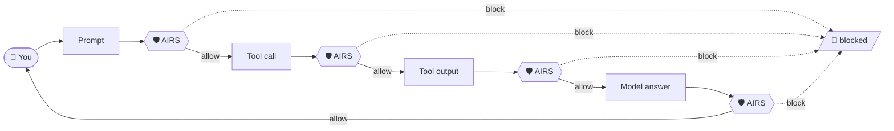

<div align="center">

# 🛡️ Prisma AIRS — Security Hooks

**Scan every step of your AI coding agent's loop — prompt, tool call, tool output, and final answer — through [Prisma AIRS](https://pan.dev/prisma-airs/).**

[](LICENSE)
&nbsp;
&nbsp;
&nbsp;

[**Quick start**](#quick-start) &nbsp;·&nbsp; [Agents](#supported-agents) &nbsp;·&nbsp; [Runtimes](#runtimes) &nbsp;·&nbsp; [Correlation IDs](#correlation-ids--what-to-send) &nbsp;·&nbsp; [Validation](#validation)

</div>

> [!IMPORTANT]
> These hooks are **community examples and reference implementations**, supported as best-effort by Palo Alto Networks. They illustrate integration patterns — review, adapt, and validate them for your own environment before any production use.

## Quick start

**Three steps, about a minute, no build step.** The example is Cursor + Node — swap in your agent's folder and your runtime.

**1 · Copy your agent's config folder into your project**
```bash
cp -r Cursor/nodejs/.cursor  /path/to/your/project/
```

**2 · Set your Prisma AIRS credentials**
```bash
export PRISMA_AIRS_API_KEY="your-api-key"        # from your Prisma AIRS tenant
export PRISMA_AIRS_PROFILE_NAME="your-profile"   # your security profile
```

**3 · Start your agent — done.**
Every prompt, tool call, tool output, and final answer is now scanned by Prisma AIRS. Malicious input is blocked before it runs; risky output is redacted or flagged.

> [!TIP]
> **Not sure where to start?** Open your agent's folder for a copy-paste install in all three runtimes:
> [Claude Code](ClaudeCode/) · [Codex](Codex/) · [Cursor](Cursor/) · [Cline](Cline/) · [Devin](Devin/) · [Gemini CLI](GeminiCLI/)

## How it works

Prisma AIRS sits at **four checkpoints** of the agent loop. Input-side hits are blocked before they run; output-side hits are redacted or flagged before they reach you.



## Supported agents

Every agent ships its **real config directory** (`.cursor/`, `.claude/`, …) for all three runtimes — installing is literally *copy the folder in*.

| Agent | Prompt | Response | Streaming | Pre-tool | Post-tool |
|:--|:--:|:--:|:--:|:--:|:--:|
| [Claude Code](ClaudeCode/) | ✅ | ✅ | ❌ | ✅ | ✅ |
| [Codex](Codex/) | ✅ | ✅ | ❌ | ✅ | ✅ |
| [Cursor](Cursor/) | ⚠️ | ❌ | ❌ | ✅ | ⚠️ |
| [Cline](Cline/) | ✅ | ✅ | ❌ | ✅ | ✅ |
| [Devin](Devin/) | ⚠️ | ❌ | ❌ | ✅ | ⚠️ |
| [Gemini CLI](GeminiCLI/) | ✅ | ⚠️ | ❌ | ✅ | ✅ |

<div align="center"><sub>✅ hard-block &nbsp;·&nbsp; ⚠️ scan + alert / redact (no hard-block) &nbsp;·&nbsp; ❌ no usable surface in the client's hook contract</sub></div>

<details>
<summary><b>Why isn't every cell ✅?</b></summary>

<br>

Coverage reflects what each agent's hook API **actually allows** — verified against real clients, not an idealized maximum:

- **Cursor / Devin** — the client exposes no way to hard-block the model's *final answer*, and the prompt / post-tool hooks are advisory (scan + alert). The **pre-tool** gate is a real hard-block (✅).
- **Gemini CLI** — the answer hook is advisory: blocking it triggers a model-retry loop, so **Response** is ⚠️.
- **Claude Code / Codex / Cline** — full hard-block at every checkpoint.

Full detail is in each agent's README. Detection categories: <https://pan.dev/prisma-airs/api/airuntimesecurity/usecases/>
</details>

## Runtimes

Pick whichever you already have — all three reach the same **allow / block** decision (the nodejs engine adds DLP masking + multi-chunk scanning on top).

| Runtime | Requires | Best for |
|:--|:--|:--|
| **`nodejs/`** | Node 18+ · zero deps | The full engine — adds DLP mask-in-place + multi-chunk scanning |
| **`bash/`** | `jq` + `curl` | macOS / Linux |
| **`powershell/`** | PowerShell 5.1+ / 7 · no `jq`/`curl` | Windows-native |

<sub><b>Core parity</b> (all runtimes): four checkpoints, correct AIRS content-types incl. <code>tool_event</code> (<code>tools/call</code>) for indirect-injection, fail-closed input / fail-open output, no silent truncation.</sub>

## Correlation IDs — what to send

Prisma AIRS ties scans together with **two slots**, exposed under **three field
names**. Getting the mapping right is what makes a conversation show up as one
thread in AIRS instead of scattered singletons.

| Slot | Field(s) in request/response | Meaning | Fill precedence |
|---|---|---|---|
| **Session** (per-conversation) | `session_id` — and legacy `tr_id`, a **mirror** of it | groups every turn of one conversation; **stored & queryable** by `scan_id` | `session_id` › `tr_id` › server-minted `pan_…` |
| **Transaction** (per-turn/request) | `transaction_id` | pinpoints one scan / one turn | `transaction_id` › server-minted `pan_…` |

**Choose what to send:**

| You have… | Put it in | What AIRS does |
|---|---|---|
| a stable conversation/thread id (Cursor `conversation_id`, Claude `session_id`, Cline `taskId`) | `session_id` | groups the whole conversation |
| a unique per-turn id (a tool-call id, prompt id, or a fresh UUID) | `transaction_id` | labels the exact turn |
| only a legacy `tr_id` | migrate it to **`session_id`** | `tr_id` is the session alias — see rules |
| nothing | *(omit)* | AIRS mints `pan_…` for both; correlation is server-side only |

**Rules (proven live — see [docs/airs-correlation-id-findings.md](docs/airs-correlation-id-findings.md)):**
- `transaction_id` is the **only** field that fills the transaction slot. `tr_id` does **not** feed it.
- `tr_id` **always equals** `session_id` in the response — legacy; never use it as a per-turn id.

Both `session_id` and `transaction_id` are capped at **100 characters** (an AIRS field limit).

**Samples** (real live echoes):

```jsonc
// ✅ Send session only — the Cursor case (conversation_id → session_id)
→  { "session_id": "conv-8a3f", "ai_profile": {…}, "contents": [{ "prompt": "…" }] }
←  { "session_id": "conv-8a3f", "tr_id": "conv-8a3f",
     "transaction_id": "pan_cb828209-…", "scan_id": "…", "action": "allow" }

// ✅ Send both — recommended when you have a per-turn id
→  { "session_id": "conv-8a3f", "transaction_id": "turn-806c8c29", "contents": [{…}] }
←  { "session_id": "conv-8a3f", "tr_id": "conv-8a3f", "transaction_id": "turn-806c8c29" }

// ⚠️ Legacy tr_id-only — what NOT to do
→  { "tr_id": "turn-c9dc4f90", "contents": [{…}] }
←  { "session_id": "turn-c9dc4f90", "tr_id": "turn-c9dc4f90",
     "transaction_id": "pan_699b0d6b-…" }
```

**How these hooks fill the slots automatically:** each agent's own conversation/session
identifier becomes `session_id` (Cursor `conversation_id`, Cline `taskId`, Claude Code /
Codex `session_id`, Gemini CLI `conversationId`), falling back to a hash of the working
directory; `transaction_id` comes from a per-turn id (`tool_use_id` / `prompt_id` /
`turn_id`) when the agent provides one, else it reuses `session_id`. **Cursor** supplies a
per-conversation id but no per-turn id, so `transaction_id` reuses the conversation id
(constant across the conversation) unless you export your own or let AIRS mint one.

## Validation

Every agent ships `tests/run-tests.sh`, running shared fixtures through all three runtimes. **Offline** (no key) it exercises block rendering; set `PRISMA_AIRS_API_KEY` + `PRISMA_AIRS_PROFILE_NAME` for a **live** detection run.

<div align="center">
<br>
<sub>MIT © 2026 Palo Alto Networks &nbsp;·&nbsp; built for <a href="https://pan.dev/prisma-airs/">Prisma AIRS</a></sub>
</div>
