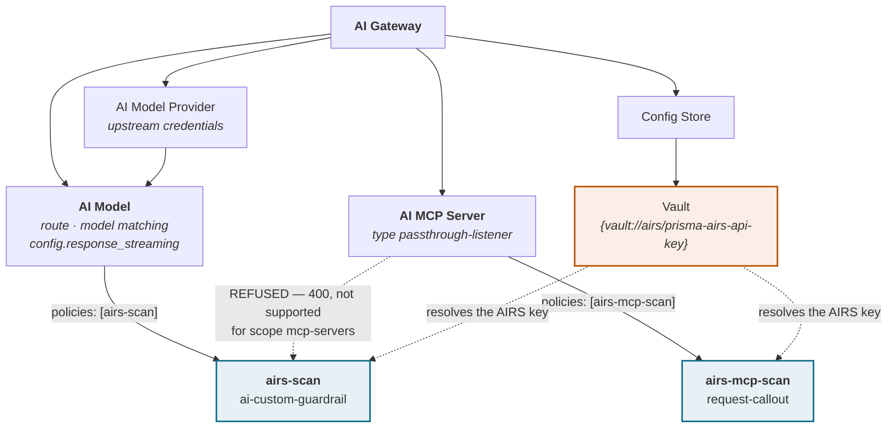
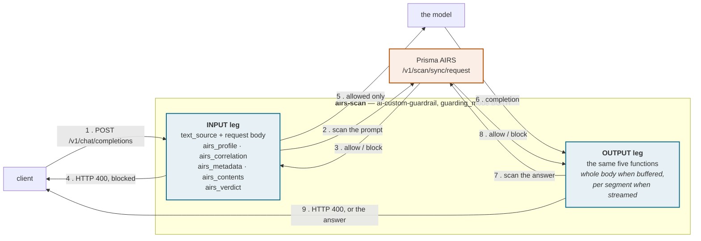
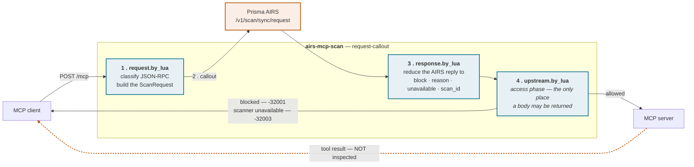

# Design

Prisma AIRS enforcement on Kong AI Gateway 2.x, expressed entirely as configuration: no custom plugin, no
rebuilt image, and Lua that travels inside the policy rather than as a package on disk. `docs/DEPLOYMENT.md`
is the runbook, `docs/CREDITS.md` the full attribution.

| Tag | Meaning |
| --- | --- |
| DOCUMENTED | Stated by Kong or by Palo Alto Networks in published documentation, or visible verbatim in this repository's source. |
| MEASURED | Established on a live gateway. Unless stated otherwise the date is 2026-09-12 and the runtime is Kong AI Gateway 2.0.3, Konnect control plane, self-managed data plane in Docker, scanner Prisma AIRS API Intercept `/v1/scan/sync/request`. Results dated **2026-09-14** were established by the prior-art project on their own AI Gateway 2.0.3 / Kong Gateway 3.14.0.3 data plane and a live AIRS tenant; they are attributed in `docs/CREDITS.md` and are not repeated here. |
| UNVERIFIED | Believed, not tested. Never relied on by the design. |

No tenant-specific value appears here; placeholders are `<AI_GATEWAY_ID>`, `<REGION>`, `my-profile`,
`my-model`, `my-mcp`.

| Traffic | Policy type | Scope | Enforcement point |
| --- | --- | --- | --- |
| LLM (OpenAI-format chat completions) | `ai-custom-guardrail` | AI Models | the guardrail's own block contract |
| MCP (JSON-RPC over HTTP) | `request-callout` | AI MCP Servers | `config.upstream.by_lua`, access phase |

It is two policies because it has to be (4.1). DOCUMENTED: Kong's hub ships guardrail integrations for AWS,
Azure, GCP, Lakera and NVIDIA NeMo. There is no Palo Alto Networks entry, and `ai-custom-guardrail` is the
documented generic hook — "Integrate with any 3rd-party Guardrail service."

---

## 1. The entity model as it matters here

AI Gateway 2.x is a separate entity tree, not a Kong Gateway control plane with AI features bolted on.
MEASURED: AI Gateways are not under `/v2/control-planes` but at
`https://<REGION>.api.konghq.com/v1/ai-gateways`, with sub-resources `policies`, `models`,
`model-providers`, `mcp-servers`, `agents`, `consumers`, `nodes`, `certificates`, `data-plane-certificates`,
`auth-strategies` and `config-stores`; `dp-client-certificates`, `data-planes` 404.

| Entity | Declarative key | What it is here |
| --- | --- | --- |
| AI Gateway | `!lookup { id: !env AI_GATEWAY_ID }` | The container for everything below. Created by a three-step wizard: control plane, data plane type, deploy instances. MEASURED: no region field — region comes from the organisation. |
| AI Model Provider | `ai_gateway_model_providers` | Upstream credentials and provider flavour. Discriminated union; `type:` selects `openai`, `azure`, `bedrock` and others. |
| AI Model | `ai_gateway_models` | The client-facing route, the model-matching rule, the targets, and `config.response_streaming`. Union selector `type: model` or `type: api`. |
| AI MCP Server | `ai_gateway_mcp_servers` | An MCP endpoint. Union selector with five values: `conversion-only`, `conversion-listener`, `listener`, `passthrough-listener`, `upstream-server`. This design targets `passthrough-listener`. |
| AI Policy | `ai_gateway_policies` | The unit of enforcement. Both halves of this integration are policies. |
| Vault | `ai_gateway_vaults` | Resolves `{vault://<vault-name>/<key>}`, and decides *where* the AIRS key rests (section 9). |

MEASURED: `kongctl explain <res> --extended` omits union selector fields, so `type:` is invisible and the
apply fails with `missing required union selector type`; `kongctl scaffold <res>` is authoritative.

### What binds to what

**MEASURED: an AI Policy defaults to `global: false`, and in that state it intercepts nothing.** A
policy that is written, applied and then never listed anywhere silently does nothing, with no warning. It
becomes active either by being named in the consuming entity's `policies:` list — the value is the policy's
`name`, not its declarative `ref` — or by `global: true`, which covers every model, MCP server and agent on
the gateway.

```yaml
ai_gateway_models:
  - ref: my-model
    policies: [airs-scan]

ai_gateway_mcp_servers:
  - ref: my-mcp
    policies: [airs-mcp-scan]
```

Binding by name keeps the blast radius to the entities an operator chose, and makes coverage only as good as
the binding: a caller reaching a model whose policy was never attached is not scanned. MEASURED:
`response_streaming: allow|deny` is a field on the AI **Model** (`config.response_streaming`), not on any
policy; it is the strict-mode remedy for GAP 1's partial coverage (8.1), applied to the model. Routing and
upstream-URL traps are in the troubleshooting table of `docs/DEPLOYMENT.md`.

---



A policy attaches by **name**, and a policy that is never named anywhere defaults to `global: false`
and silently intercepts nothing.

---

## 2. What an AI Policy is at runtime

DOCUMENTED, from Kong's changelog and quoted in `config/llm/airs-guardrail.yaml`: "policies are a control
plane concept. In the runtime they're implemented as plugins." MEASURED 2026-09-12 on the data plane
container for AI Gateway 2.0.3:

- The data plane's telemetry URL reports `node_version=3.14.0.3` alongside `kong_aigw_version=2.0.3`,
  `kong version` answers "Kong AI Gateway 2.0.3", and the image's OCI label is
  `org.opencontainers.image.title=kong-ee`.
- `/usr/local/share/lua/5.1/kong/plugins/` holds the full classic plugin set, over a hundred directories
  — `ai-custom-guardrail`, `request-callout`, `post-function`, `pre-function`, `ai-proxy`,
  `ai-proxy-advanced`, `ai-mcp-proxy`, `ai-prompt-guard` and the rest.

The conclusion to draw, stated carefully and not further:

> The runtime is Kong Gateway 3.14 with the classic plugin loader intact. What AI Gateway 2.x removes
> is the **control plane surface for declaring a custom plugin** — not the runtime's ability to run Lua.

That is why this is possible at all, and why it is shaped this way: with no supported path to *declare* a
custom plugin, the Lua arrives as the value of a config field on a policy that already exists.

The Lua therefore lives in real `.lua` files, inlined into the policy at build time by
`scripts/build-config.py` and unit-tested offline by `spec/verdict_spec.lua` and
`spec/mcp_callout_spec.lua` (114 and 87 assertions, 201 in total) — Lua living only inside a YAML string is Lua nobody
lints or reviews.

---

## 3. The LLM path, end to end



A streamed response reaches the OUTPUT leg only in part — per-segment, with a floor and a tail left
unscanned — and tool-call arguments are not part of the text Kong extracts at all. Both are in section 8.


One `ai-custom-guardrail` policy, `guarding_mode: BOTH`. On the INPUT leg Kong matches the route on
`body.model`, extracts the prompt text, builds the AIRS `ScanRequest` from `$(airs_profile)`,
`$(airs_correlation)`, `$(airs_metadata)` and `$(airs_contents)`, POSTs it and applies
`$(airs_verdict.block)`: a block is HTTP 400 and the model is never called, otherwise the model answers and
the completion goes through the same five functions on the OUTPUT leg before the client sees it.

DOCUMENTED enum: `BOTH | INPUT | OUTPUT`. MEASURED: `BOTH` genuinely runs both legs — confirmed in Strata
Cloud Manager (SCM) as two separate transactions, one Prompt, one Response. The direction is not cosmetic:
AIRS keys the two differently (`contents[].prompt` versus `contents[].response`) and runs a different
detector set on each. The built-in `$(source)` is `INPUT` or `OUTPUT`, and it is what the content function
switches on.

### 3.1 How a function is called

MEASURED 2026-09-08 (`docs/CREDITS.md`): functions are referenced **bare** and Kong injects
built-ins **by parameter name** — `airs_contents` receives `source` and `content` because its parameters are
named that. The explicit-argument form `$(airs_contents(source, content))` returns HTTP 500 `failed to
render by function: invalid expression syntax`. The injectable parameter allowlist is exactly `source`,
`content`, `conf`, `resp`; `consumer`, `model`, `route`, `service`, `request`, `headers` and `kong` are
rejected outright with `argument '<name>' is not allowed in guardrail functions`.

**That allowlist governs arguments, and nothing else.** It was long read as also describing what a function
can reach, and that reading was wrong — the error is named in `docs/CREDITS.md`, because a negative
established by probing parameter names was carried over to a mechanism that had never been tested.
MEASURED 2026-09-14: inside the function BODY, `kong` and `ngx` are tables and `require` is a function.
Reachable and used here: `kong.request.get_body()` (the structured `messages[]`, in both phases,
chronological, with `tools[]` and `tool_calls`), `kong.request.get_header()`, `ngx.ctx.ai_model`,
`kong.client.get_forwarded_ip()` / `get_ip()` / `get_consumer()`, `ngx.var.request_id`, and a
`kong.ctx.shared` that persists from the INPUT leg to the OUTPUT leg of the same buffered request. Not
reachable: `kong.router.*` is nil, `kong.log.serialize()` refuses in this phase.

**Every PDK call is wrapped in `pcall`, and that is a security requirement rather than a style.** MEASURED
2026-09-14: on the OUTPUT leg of a *streamed* response the function runs with no request context, and an
unguarded raise there does not fail the request the way a raise on a buffered leg does (5.1) — it silently
skips the guardrail call for that segment. One streamed request, same policy: a constant-returning function
gave 7 segment scans, the same function calling `kong.request.get_header` unguarded gave 0 with HTTP 200 and
the whole stream delivered, and the same calls in `pcall` gave 7 again. An unguarded PDK call in a guardrail
function is a silent **fail-open**, and `spec/verdict_spec.lua` asserts against it.

One more asymmetry those runs pinned, which explains a lot of the code below: a `request.body` field that is
`nil` is omitted from the scan payload, while a field that is an empty string is rendered as JSON `false`.
A value that cannot be built is therefore returned as `nil`, never as `""`.

### 3.2 The five functions

| Function | Runs | Returns | Refuses when |
| --- | --- | --- | --- |
| `airs_profile(conf)` | every scan, both legs | `{ profile_name = conf.params.profile }` | — |
| `airs_correlation(conf)` | every scan, both legs | `{ transaction_id, session_id }` — the round and the conversation — or `{}` when there is no request context | never; it returns `{}` rather than raising |
| `airs_metadata(conf)` | every scan, both legs | `{ app_name, ai_model, user_ip, app_user }`, each omitted when nothing could build it | never; every lookup is `pcall`-guarded |
| `airs_contents(source, content, conf)` | every scan, both legs | ONE element: `{{ prompt = … }}` on INPUT, rebuilt from the request body and attributed per turn; `{{ response = content }}` on OUTPUT | `content` is not a string; `content` is empty; `source` is neither `INPUT` nor `OUTPUT` |
| `airs_verdict(resp)` | after the AIRS reply, both legs | `{ block, block_message, detail }`, `detail` a table `{ reason, category, detections }` on every path (MEASURED 2026-09-14: `metrics.block_detail` rejects a string, 8.4) | section 5.1 |

`airs_contents` raising is deliberate: a fallback such as `content or ""` would JSON-encode whatever arrived
— potentially the whole `conf` table — into `contents[].prompt` and ship it to AIRS and the SCM scan log,
and AIRS returns `allow` on an empty string, so a silent extraction gap would become a recorded clean scan
of nothing. MEASURED 2026-09-08 (prior art, `docs/CREDITS.md`): a raising guardrail function fails the
request closed at HTTP 500, and the raised text reaches the client verbatim — function name and line
included — which is why no message here carries a config value or a credential. `airs_metadata` invents
nothing — a field nothing could build is absent, because a fabricated user in a security log is worse than
none.

Note the asymmetry between the three: `airs_contents` raises, `airs_metadata` and `airs_correlation` never
do. It is deliberate. A content function that cannot build the text to scan must stop the request, because
proceeding means an unscanned request. A metadata or correlation function that cannot build a label must
not, because on a streamed OUTPUT segment it never can — and raising there skips the scan rather than
refusing the request (3.1).

### 3.2.1 What is actually scanned, and why it is not `$(content)` alone

`text_source: concatenate_all_content` is chosen over the schema default `last_message` because it is the
only value under which a `role: "tool"` result — untrusted external text injected into the conversation —
reaches the scanner. MEASURED 2026-09-08: the extracted text is the message contents joined by `"\n\n"` in
**reverse chronological order**, system prompt included, **with no indication of who said what**.

That last part is not cosmetic. MEASURED 2026-09-14 on a live tenant: the ordinary exchange
`And Italy? / The capital of France is Paris. / What is the capital of France?` is blocked **3 times out of
3** as agent + prompt injection, and the threat report's `pi_snippets` field contained that exact string.
The model's own previous answer, unattributed, reads as an assertion somebody planted in the prompt. The
matrix, three runs per cell:

| Order | Roles | Result |
| --- | --- | --- |
| reverse | unlabelled | blocked 3/3 |
| chronological | unlabelled | blocked 3/3 — so the order is not the cause |
| chronological | labelled | clean 3/3 |
| reverse | labelled | clean 3/3 |

Labelling does not blunt detection: a real injection alone, as the newest turn, and as an earlier turn all
still block 3/3. So `airs_contents` rebuilds the scanned text from `kong.request.get_body().messages`,
chronological, prefixing `user:` and `assistant:`, and `text_source` becomes the **fallback** for any body
shape the rebuild does not understand — which is why it must stay at the widest value.

**It never writes `system:`.** MEASURED 2026-09-14: `system: You are a helpful assistant.` in front of
otherwise labelled turns is blocked 3/3 as agent + injection, capitalised `System:` blocks too, the same
content unlabelled is clean, and `Instructions:` as a label is clean. That is the scanner being right — a
prompt claiming to carry a system message is the shape of a system-prompt spoof. The system message, tool
results and any unrecognised role go in **unlabelled**.

**It returns exactly one element, and this is the one thing in this file most likely to be "fixed" into a
defect.** DOCUMENTED: the scan endpoint describes `contents[]` as a list whose "last element is the one that
needs to be scanned", the previous ones being context. MEASURED 2026-09-14, five probes: an injection sent
alone blocks; the same injection as the first of two elements comes back `allow`/`benign`; as the first of
three, `allow`/`benign`; as the last element, blocks. Earlier elements are **not judged**. Splitting a
conversation one-element-per-message therefore stops scanning every turn but the newest, silently.
`spec/verdict_spec.lua` fails if the function ever returns more than one element.

**Array content.** A turn's `content` is an array of parts as soon as a client attaches an image or a file.
Text parts are assembled and attributed; `image_url`, `input_audio` and `file` parts carry no text and are
skipped, so an image-only turn contributes nothing. Any other part type, a non-table part, or an empty
array on a turn that is not a tool call, falls back to the flat `$(content)` text — an unrecognised shape
must never be allowed to narrow the scan, which is exactly what an earlier version of this logic did by
skipping such turns while the other turns kept the rebuild non-empty.

### 3.3 How a block reaches the client

MEASURED 2026-09-12, with `rejection_mode: none`:

```text
benign prompt      -> HTTP 200, answer returned
prompt injection   -> HTTP 400
                      {"error":{"message":"Blocked by Prisma AIRS [scan_id=<uuid>]"}}
```

It is **400, not 403**. The Kong Gateway 3.x custom plugin returns 403 for the same event, so clients and
log-based alerting keyed on the status must expect the difference; the MCP half answers 403 (4.4), so the
two halves do not share a status code either. UNVERIFIED: the exact status line and body of `rejection_mode:
stealth`; if it is used, expect the `scan_id` to stop reaching the client and the support path in 7.4 to go
with it. The two gaps on this path — the floor, tail and delay of a streamed response (8.1) and a tool
call on the leg that emits it (8.2) — are in section 8, together with the block-metrics defect fixed in
8.4. Do not deploy this half without reading it.

---

## 4. The MCP path, end to end



Every hook sits to the left of the upstream call. Nothing in this policy runs after the MCP server
answers, which is why the dashed return path is unscanned.


### 4.1 Why `request-callout` and not a guardrail

`ai-custom-guardrail` cannot be attached to an MCP server: MEASURED 2026-09-12, the Konnect control plane
refuses the update.

```text
400 Bad Request
policies: policy "<name>" of type "ai-custom-guardrail" is not supported
for scope "mcp-servers"
```

That is the API confirming, rather than the reader inferring, the gap Kong states in the `ai-mcp-proxy`
scope-of-support table: "AI Guardrails | Applying guardrails to MCP AI plugin requests and responses | Not
supported" (DOCUMENTED). MEASURED: `request-callout` **is** accepted at `mcp-servers` scope, the only
configuration-level way found to send MCP content to a scanner and act on the answer.

### 4.2 The three hooks, and the fact that decides the design

DOCUMENTED — the schema declares exactly three Lua hooks: `callouts[].request.by_lua` ("executes before the
callout request is made"), `callouts[].response.by_lua` ("executes after the callout response is received" —
AIRS's reply, not the MCP server's), and `config.upstream.by_lua` ("executes before the upstream request is
made").

**DOCUMENTED: all three run before the upstream request.** The schema declares no `header_filter`, no
`body_filter`, no response-phase hook of any kind. **MEASURED: the consequence is real** — a payload placed
in a tool *result* is delivered to the client with HTTP 200, so the MCP response leg is unreachable by this
policy; 4.5 and 8.3 have the measurement and the consequences.

`config.upstream.by_lua` runs in the **access phase**. DOCUMENTED: the Kong PDK permits `kong.response.exit`
with a body only in `preread`, `rewrite`, `access` and `admin_api` — the entire reason an in-protocol error
is possible, and why enforcement lives in `upstream.by_lua` alone. In order: `request.by_lua` classifies the
envelope and builds the `ScanRequest`; the callout fires; `response.by_lua` reduces the reply to `{ block,
reason, scan_id }` in `kong.ctx.shared`; `upstream.by_lua` reads it and either falls through to the MCP
server or exits 403. The server's answer then returns to the client uninspected.

### 4.3 `request.by_lua` — classify and build

It reads the client's JSON-RPC envelope, writes the `ScanRequest` into the callout body and records the
classification, method, id and scanned flag in `kong.ctx.shared`. The rules, in
`lua/callout/request_by_lua.lua` and exercised by `spec/mcp_callout_spec.lua`:

| Input | Classification | Sent to AIRS as |
| --- | --- | --- |
| `tools/call` with encodable `params.arguments` | `tool_event` | a `contents[].tool_event` with `ecosystem: mcp`, `method: tools/call`, `server_name`, `tool_invoked`, and `input` as a JSON **string** |
| `tools/list` | `bypass` | nothing — the catalogue is in the reply, which this policy cannot see |
| `ping`, `initialize`, `notifications/*`, `logging/setLevel`, or any content-bearing method with no `params` table | `bypass` | nothing |
| any other content-bearing method (`resources/read`, `prompts/get`, `completion/complete`, `sampling/createMessage`, `elicitation/create`, vendor extensions) | `prompt` | a `contents[].prompt` holding the encoded `params` |
| a body that does not decode to a JSON object | `unparseable` | nothing — not scanned, so **refused** by default |
| a top-level JSON array (JSON-RPC batch) | `batch` | nothing — not scanned, so **refused** by default |
| anything without `jsonrpc: "2.0"` and a string `method` | `not-jsonrpc` | nothing — not scanned, so **refused** by default |
| classification or encoding threw | `error`, `fatal` | nothing, and the message is refused |

Three rows are load-bearing.

- **The method allowlist is forced by AIRS, not chosen.** MEASURED against the AIRS scan API (4.6):
  `tool_event.metadata.method` is validated against exactly `tools/call` and `tools/list`; every other
  method is refused with `400 unsupported method`, `initialize` included, so a gateway submitting
  `initialize` as a tool event would fail the first message of every MCP session closed. Out-of-allowlist
  methods carrying caller text go as a **prompt**, which has no method allowlist: same coverage, different
  shape.
- **The bypass set carries no caller text on the request leg**, and AIRS allows an empty string, so
  scanning it would record a clean scan of nothing. `request-callout` has no conditional-skip field, so
  the callout fires anyway with a placeholder prompt of `"."`, the message is recorded as a bypass, and
  `upstream.by_lua` ignores its verdict — at the cost of one AIRS call per control message and an SCM
  record that is a clean scan of a single dot (7.5).
- **A batch refuses classification rather than inspecting element one**, since inspecting the first and
  waving the rest through is an evasion primitive. Refusing to classify is not by itself refusing the
  message, so `upstream.by_lua` closes that distinction: `batch`, `not-jsonrpc` and `unparseable` take
  the same path as `fatal` — HTTP 403, JSON-RPC `-32001`, upstream never reached. A `tools/call` can be
  inside any of the three and none of them was inspected, so the control does not default open on it.
  The deliberate bypasses above are unaffected: they carry no caller content, so there is nothing to
  refuse. Pass-through remains available as `params.unclassified_action: "allow"`, because UNVERIFIED:
  Kong's behaviour on receiving a batch at an MCP route, and a legitimate client may yet trip this. The
  comparison is an exact match on `"allow"`, so an empty value, a typo or an unsubstituted placeholder
  all refuse — the default and the accident give the same safe answer. Choosing `allow` is a
  transport-compatibility decision rather than a security one.

The hook also unescapes cjson's forward-slash escaping, since handing a path detector `\/etc\/shadow` lowers
the detection rate on exactly the arguments that matter, and attaches correlation from Kong rather than the
caller (7.3). `response.by_lua` then parses once, safely — DOCUMENTED by Kong, a nil reference inside
`by_lua` is an Internal Server Error at runtime — so all parsing risk sits in one hook inside a `pcall`,
which applies the same degradation tests as the LLM verdict function (5.1) and leaves the enforcement hook
reading only booleans and strings.

### 4.4 The denial contract

MEASURED 2026-09-12, through the gateway with the callout attached, HTTP 403:

```json
{"jsonrpc":"2.0",
 "error":{"message":"Blocked by Prisma AIRS [scan_id=<uuid>]","code":-32001},
 "id":<caller's id>}
```

An MCP client that receives a bare HTTP 403 sees a transport failure, and several SDKs tear the session down
on one. A JSON-RPC error carrying the caller's **own** request id is a tool failure instead: the client
surfaces it against the call that caused it and the session survives. When the id cannot be recovered
`cjson.null` is sent, never a fabrication.

| Code | Meaning | Raised when |
| --- | --- | --- |
| `-32001` | policy block | AIRS returned a block, or classification itself failed fatally so the content was never inspected |
| `-32003` | scanner unavailable | no verdict record at all, a partial scan failure, a degraded detector, an unparseable verdict, or the enforcement hook itself throwing |

Both codes match PANW's Kong Gateway 3.x plugin exactly, so a client that has learned one Prisma AIRS
integration has learned both. DOCUMENTED: from Kong Gateway 3.14 onward Kong's own MCP **authorization**
denials follow the MCP 2025-11-25 specification and answer 403 — that specification does not govern scan
verdicts, and this integration matches it only so one denial shape comes off the MCP route.

### 4.5 Measured behaviour

MEASURED 2026-09-12, through the gateway with the callout attached:

| Request | Result |
| --- | --- |
| `tools/call`, clean arguments | 200, allowed |
| `tools/call`, injection in arguments | **403**, JSON-RPC error, code `-32001` |
| `tools/call`, payload in the **result** | **200, DELIVERED** — the response leg is unreachable |
| `initialize` | 200, bypassed unscanned |
| `tools/list` | 200, bypassed on the request leg |

MEASURED: the route requires `Accept: application/json, text/event-stream`; without it the MCP proxy answers
`406 Not Acceptable`, so a 406 in testing is almost always that header, not a policy fault.

### 4.6 The AIRS `tool_event` contract, as measured

MEASURED 2026-09-12 against the AIRS scan API, independently of Kong; the shape is easy to get wrong in a
way that looks like it worked. **`tool_event` is a member of a `contents[]` element, not a top-level sibling
of `contents`.** At the top level the API answers HTTP 400 with
`{"error":{"message":"\"empty content data\"\n"}}` and silently ignores the tool event — a message that
never mentions tool events. The decisive one comes from a request carrying an empty content object:

```text
content validation failed: at least one of Prompt, Response, CodePrompt,
CodeResponse, or ToolEvent must be provided
```

The correct shape:

```json
{"ai_profile": {"profile_name": "my-profile"}, "metadata": {"app_name": "kong-ai-gateway"},
 "contents": [{"tool_event": {"metadata": {"ecosystem": "mcp", "method": "tools/call",
    "server_name": "my-mcp", "tool_invoked": "get_customer"}, "input": "{\"id\":\"42\"}"}}]}
```

`input` and `output` are **strings containing JSON**, not nested objects; a native object earns `400
received wrong request format`. `tool_invoked` **is** accepted by the API, and is echoed back in the
detection record, naming the tool. `server_name` is pinned at build time from `AIRS_MCP_SERVER_NAME`,
since a callout `by_lua` cannot read its own config.

MEASURED detections against that API:

| Submitted | `action` | `category` | Detail |
| --- | --- | --- | --- |
| clean tool input | allow | benign | — |
| injection in tool ARGUMENTS, as `input` | block | malicious | threats `["context poisoning"]`; detectors agent + injection + toxic_content |
| injection in tool RESULT, as `output` | block | malicious | same detectors |
| a poisoned `tools/list` catalogue, as `output` | block | malicious | `tool_invoked` names the poisoned tool |

**State the conclusion in this order: AIRS can detect tool poisoning and malicious tool results today.
The limitation is Kong's** — `request-callout` has no hook that sees the response leg, so the gateway has
nothing to hand AIRS for rows three and four; the scanner is not the missing piece (8.3).

### 4.7 Attachment caveats

The policy is written for `passthrough-listener` MCP servers, where there is a real upstream and the tool
descriptions are attacker-controlled rather than Kong's own configuration. UNVERIFIED: `conversion-listener`
mode, where `ai-mcp-proxy` rewrites the call into REST and it is unknown whether the callout still sees
JSON-RPC. UNVERIFIED: plugin ordering — `ai-mcp-proxy` runs at 820 and `request-callout` at 812, and
`kong.response.exit` interrupts the phase, so anything Kong answers itself (a `tools/list` from its own
definitions, an ACL denial) plausibly never reaches the callout. Assume those paths exist until measured.

---

## 5. Fail-closed behaviour

The rule is the same on both paths: **anything that is not a positive, unambiguous `allow` is a block.** A
message that was never scanned is not a message that passed.

### 5.1 LLM path — every condition under which `airs_verdict` blocks

Read in order; the first match wins.

`detail` is a Lua table, `{ reason, category, detections }`, on every row below and on the allow path too
(MEASURED 2026-09-14, 8.4: `metrics.block_detail` silently drops the metric on every request if it is a
string instead). `category` mirrors `resp.category` where one exists; `detections` is the sorted array of
detector names that fired, when there are any.

| # | Condition | `detail.reason` |
| --- | --- | --- |
| 1 | `resp` is not a table, or `resp.action` is not a string | `verdict unavailable (fail-closed)` |
| 2 | `resp.error` is set (anything but `nil`/`false`) | `partial scan failure (fail-closed)` |
| 3 | `resp.timeout` is set | `partial scan failure (fail-closed)` |
| 4 | `resp.errors` is a non-empty table | `detector degraded (fail-closed)`, with `detail.detections` = `{ "<feature>/<status>", … }` |
| 5 | `resp.category` is `error` or `timeout` | `scan <category> (fail-closed)` |
| 6 | `resp.action` is anything other than exactly lowercase `allow` | the category when the action is `block`, otherwise `unrecognised action (fail-closed)`, with `detail.detections` = the names of the detectors that fired |

Conditions 2 to 4 matter most and are the ones most integrations omit. The AIRS `ScanResponse` carries
`error` and `timeout` on every 200 body, plus an `errors[]` array naming the degraded detector
(`{content_type, feature, status}`). A detector can fail or time out while the verdict still returns
`action: "allow"` — the scan did not say the content is safe, it said it could not finish looking, and a
verdict keyed only on `action` or `category` reads that as a clean pass. The test for "set" is loose, so a
string cannot read as "no problem"; condition 6 maps no near-misses, because the safe reading of an unknown
word is "not a pass".

`airs_contents` raises when the content is not a string, is empty, or the phase is unrecognised, and a
raising function fails the request closed at HTTP 500 (MEASURED 2026-09-08). `airs_verdict` keeps
an inactive branch decoding `resp` as a string, because a release that ever did pass one would fail every
request closed: MEASURED 2026-09-08, `$(resp)` is a Lua table in **both** phases on 2.0.3,
contradicting Kong's plugin overview.

### 5.2 The one deliberate exception

`category` alone is **not** a block on the allow path. An AIRS profile in alert-only mode returns
`action: "allow"` alongside `category: "malicious"`, and that is the profile owner exercising a legitimate
choice: the gateway enforces the verdict AIRS returns, it does not second-guess the profile. This is the
only signal-looking thing intentionally let through, and it is the difference between enforcing a policy
and overriding it.

### 5.3 MCP path — every condition under which `upstream.by_lua` refuses

| # | Condition | Code | Message to the client |
| --- | --- | --- | --- |
| 1 | classification itself failed (`mcp.fatal`) — the content was never inspected | `-32001` | `Blocked by Prisma AIRS` |
| 2 | no verdict record at all: `response.by_lua` never ran, so the callout never completed | `-32003` | `Prisma AIRS scan unavailable` |
| 3 | verdict blocks and carries `unavailable = true` — `response.by_lua` sets that field on every degradation branch: `verdict unavailable`, `verdict parse failure`, `partial scan failure`, `detector degraded`, `scan error`, `scan timeout` | `-32003` | `Prisma AIRS scan unavailable` |
| 4 | verdict blocks for any other reason (a real detection, or an unrecognised action) | `-32001` | `Blocked by Prisma AIRS [scan_id=…]` |
| 5 | the enforcement hook itself raised | `-32003` | `Prisma AIRS scan unavailable`, id `null` |

`unavailable` is a field on the verdict, set by `response.by_lua` next to the reason, and it is what this
hook reads; the literal reason strings are matched only as a fallback for a verdict written by an older
build. That matters because the old string list missed `scan error` and `scan timeout`, so an AIRS-reported
scan failure was answered as a policy block.

A message classified as a deliberate bypass (`scanned ~= true`) is allowed through, and the callout's
verdict for it is ignored rather than being allowed to block a message nobody scanned. Availability is
handled twice over. The callout's `error` block (`on_error: fail`, no retries,
`http_statuses: [429, 500, 502, 503, 504]`, `error_response_code: 502`,
`error_response_msg: "Prisma AIRS scan unavailable"`) matches the callout's **HTTP status**, and answers a
bare HTTP 502, not a JSON-RPC error. UNVERIFIED: that branch has not been observed here — a genuine network
failure of the callout was never induced. It cannot express a verdict, since AIRS returns HTTP 200 carrying
`action: "block"` in the body; what it misses — an AIRS 400 from a bad profile — falls through to conditions
2 and 3 above.

MEASURED 2026-09-12: with the AIRS profile misconfigured so the callout returned HTTP 400, **every**
`tools/call` was refused with `-32003` "Prisma AIRS scan unavailable" and the upstream was never reached.
The designed failure mode works: no scan, no tool call. On the LLM path the equivalent is
`stop_on_error: true`, DOCUMENTED but UNVERIFIED here, because the LLM leg has not been observed refusing
traffic with the scanner unreachable.
Two smaller choices reinforce it: caching is off at both levels (`cache.strategy: "off"`,
`cache.bypass: true`), because a cached security verdict is a replay surface, and headers are not forwarded
(`headers.forward: false`), since they carry the MCP session and upstream authorization that AIRS neither
needs nor should hold.

---

## 6. What the caller is told, and where the detail goes

The client sees `Blocked by Prisma AIRS`, optionally with the `scan_id`, and nothing else: never the
category, never a detector name, and **the same text on a fail-closed block as on a real detection.** A
caller who could tell "the injection detector fired" from "a detector timed out" would iterate against the
difference, turning the block into a detector-mapping oracle. The detail goes to three places:

| Channel | Carries | Status |
| --- | --- | --- |
| `detail` → `metrics.block_detail` | a table `{ reason, category, detections }` | **Works** — MEASURED 2026-09-14 (prior art), fixed from a string to a table (8.4) |
| The gateway error log | on the MCP path `[prisma-airs-mcp] blocked: <category> [<detector>,<detector>]`; on both paths `kong.log.err` for hook failures. A log line, not a metric: not aggregated, not exported | Works |
| Strata Cloud Manager scan log | the complete record — verdict, category, threats, detectors, and on tool events the `tool_invoked` name | Works, and is the authoritative record today |

`log_blocked_content: false` keeps the blocked prompt out of Kong's telemetry: it is content somebody tried
to push through a security control, and its access-controlled place is the AIRS scan log.

---

## 7. Correlation and its limits

Both paths now identify the caller, the model and the exchange, and `scan_id` remains the only join key the
client is ever given.

### 7.1 Identity on the LLM path, and the correction that made it possible

**This section used to say identity was unreachable.** The reasoning was that only `source`, `content`,
`conf` and `resp` can be injected into a guardrail function, so there is no request context inside one; the
observable consequence was that every scan showed `model_name: None` and `user_id: None` in SCM. The
allowlist is real and still documented at 3.1. The conclusion was wrong, and the method error is named in
`docs/CREDITS.md`: the allowlist was established by probing argument names, which says nothing about the
sandbox the function body runs in.

MEASURED 2026-09-14, `lua/guardrail/airs_metadata.lua` now sends:

| Field | Source | Fallback |
| --- | --- | --- |
| `app_name` | `params.app_name` | — |
| `ai_model` | `ngx.ctx.ai_model.name`, the AI Model entity | `kong.request.get_body().model`, then `params.ai_model` |
| `user_ip` | `kong.client.get_forwarded_ip()` | `kong.client.get_ip()` |
| `app_user` | `kong.client.get_consumer()` — `username`, else `id` | the header named by `params.user_header`, then `params.app_user` |

Three things to be exact about. **`app_user` from a header is a label, not an identity.** It is used only
when Kong has authenticated no consumer, it is caller-supplied, and it must never be read as authentication;
the consumer always outranks it, and `spec/verdict_spec.lua` asserts that ordering. **The consumer branch is
reachable but unexercised.** `kong.client.get_consumer()` returned `nil` in the lab that measured this,
because the model there carried no auth policy, so every `app_user` value observed in a scan record came
from the header — the API is proved, a populated consumer is not, and the ordering above is asserted
offline rather than measured on a gateway. **`get_forwarded_ip()` returns the `X-Forwarded-For` address
only when the immediate peer is in the data plane's `trusted_ips`**,
and otherwise returns the peer's own address — behind a load balancer, the load balancer. That is correct
Kong behaviour, it is visible in the scan log, and it is a data-plane setting rather than something this
policy can fix.

Every one of those lookups is `pcall`-guarded and may yield nothing; a field nothing could build is left
absent rather than blank, because a `request.body` field that is `nil` is omitted from the payload while an
empty string is sent as JSON `false` (3.1).

### 7.2 Correlating the two legs of one exchange, and the conversation around it

`lua/guardrail/airs_correlation.lua` sends two identifiers. They nest, and MEASURED 2026-09-14 by nine
probes sent straight at `/v1/scan/sync/request` — because no published page settles it and two plausible
readings of the field descriptions are wrong:

| Field | Means | Where it comes from here |
| --- | --- | --- |
| `transaction_id` | ONE ROUND: a prompt and the response it produced | `ngx.var.request_id`, minted on the INPUT leg and stashed in `kong.ctx.shared` so the OUTPUT leg of the same buffered request reuses it. `params.transaction_header` can hand the choice to the caller; leave it unset unless you mean to |
| `session_id` | the CONVERSATION, grouping several rounds | the header named by `params.session_header`, falling back to the round so one exchange is never split across two sessions |
| `tr_id` | **never sent** | it is the older name of `session_id`, not of `transaction_id` |

The `tr_id` row is the trap. A request carrying only `tr_id` comes back with `session_id` set to that value;
a request carrying only `session_id` comes back with `tr_id` set to it; when both are sent `session_id` wins
and the `tr_id` value is discarded. So sending the round under `tr_id` — which the field descriptions
invite, and which the endpoint's own example body does — files the round value in the conversation slot and
leaves prompt and response in different transactions. Anything not supplied is generated by AIRS as
`pan_<uuid>`.

**The conversation identifier is caller-supplied, and that is a deliberate trade.** A gateway cannot know
where a conversation starts; only the caller can. The cost is that a caller who controls the value can pin
it, split it or collide it with someone else's, exactly as 7.3 describes for the MCP path — so it is a
grouping label for a scan log, not evidence. The identifier an investigation joins on is the round, and
that one is Kong's by default and cannot be influenced.

**On a streamed response leg there are no identifiers at all.** There is no request context, the stash is a
fresh empty table, `ngx.var.request_id` raises, and the function returns `{}`. AIRS then mints `pan_<uuid>`
for both slots, so the response scans of a streamed exchange scatter as one-off sessions while the prompt
scans stay grouped. Stated rather than papered over: a fabricated fallback value would group them wrongly,
which is worse than not grouping them.

### 7.2.1 Coarse attribution, still available

Splitting traffic across several policies, each with its own `params.app_name`, remains useful and is
orthogonal to the above. DOCUMENTED: the policy scopes are AI Models, AI Consumers, AI Consumer Groups and
Global. One policy per AI Consumer Group, identical except for `params.app_name:
"my-gateway/team-a"`, makes detections carry the group name. Policy count then grows linearly, each a
separate object to keep in step.

### 7.3 The same rule on the MCP path

Both paths reach the PDK, so both send correlation identifiers; the MCP path has done so since it was
written. `lua/callout/request_by_lua.lua` sends `transaction_id` from `kong.request.get_id()`,
`session_id` from the `Mcp-Session-Id` header when present, and `tool_invoked` on `tools/call`.

**The correlation id must be Kong's own.** `kong.request.get_id()` is generated by the gateway and
cannot be influenced by the caller. A client-supplied correlation header must never be used instead, because
a caller who sets the id can **pin** it (one fixed id, so a whole campaign collapses into one apparent
transaction), **split** it (a fresh id per message, so a sustained probing session looks like unrelated
calls), or **collide** it (reuse another tenant's id, so detections interleave and an investigation is
pointed at the wrong party). Anything the attacker controls is not evidence; `spec/mcp_callout_spec.lua`
asserts that `transaction_id` is Kong's id and a client-supplied header is ignored. `Mcp-Session-Id` is
omitted when absent, never replaced by a synthetic one.

The LLM path follows the same rule with one deliberate difference, set out in 7.2: the round is Kong's id
there too, while the *conversation* is read from a client header because nothing else can know it. The
round is what an investigation joins on; the conversation is a grouping label.

MEASURED 2026-09-14 (prior art, `docs/CREDITS.md`): Strata Cloud Manager stores and displays both — a
conversation appears as one AI Session, and each round within it as one transaction carrying its prompt
scan and its response scan. That was confirmed in their tenant's SCM views, not here, and which column
renders what is a tenant-side surface, so confirm the view in your own tenant before building a workflow
on reading them back.

### 7.4 `scan_id` is the join key

MEASURED 2026-09-12: the `scan_id` in the client's block message matches the `scan_id` in the SCM record
exactly. That is the path from a user complaint to the detection record, and the only one the client is
given — in the HTTP 400 body on the LLM path (3.3), in the JSON-RPC error on the MCP path (4.4). It is a
small, deliberate leak: the caller learns a scan happened and gets an identifier that exists in a security
log. Accepted, because without it every support conversation starts with "I got an error some time this
afternoon". What is not leaked is why.

The id is appended only when the AIRS response carried one. On the fail-closed paths where no parseable
verdict came back — AIRS unreachable, an unparseable body, a missing `action` — the client sees the bare
`Blocked by Prisma AIRS` and there is no join key, because there is no scan record; those blocks are visible
in the Kong error log only.

### 7.5 Absence of a detection is not evidence of clean traffic

Several classes of traffic produce **no scan record at all**, indistinguishable in a dashboard from a clean
scan: the unscanned floor and tail of a streamed response (8.1), a tool call on the leg that emits it
(8.2), the whole MCP response leg (8.3), and the bypassed MCP control messages (4.5) — which do produce a
record, a clean scan of the placeholder prompt `"."` (4.3), so counting those inflates coverage. A streamed
response's *scanned* segments do produce records — one per `response_buffer_size` chunk (8.1) — so a stream
is not uniformly silent, only partially so. This integration reports what it scanned and nothing about what
it could not reach.

---

## 8. Coverage and limits

| Surface | Covered | Status |
| --- | --- | --- |
| LLM prompt, buffered | Yes | MEASURED |
| LLM response, buffered | Yes | MEASURED; full coverage regardless of `response_streaming` |
| LLM response, streamed | **Partial** | **GAP 1** — MEASURED per-segment scanning with a floor, a tail and a delay, 8.1. `response_streaming: deny` trades it for full (buffered) coverage |
| LLM tool definitions and replayed tool-call arguments | Opt-in | `params.tool_scan`, MEASURED 2026-09-14, off by default — 8.2 |
| LLM tool call on the leg that emits it | **No** | **GAP 2** — MEASURED, 8.2. Not fixable in configuration |
| MCP `tools/call` arguments | Yes | MEASURED, blocked in protocol with `-32001` |
| MCP other content-bearing methods | Yes, as a prompt | DOCUMENTED in source, 4.3 |
| MCP tool **results** and the `tools/list` catalogue (tool poisoning) | **No** | MEASURED, 8.3. No response-phase hook exists |
| MCP `initialize` / `ping` / notifications | Bypassed by design | MEASURED as bypassed; they carry no caller content |
| JSON-RPC batches, non-JSON-RPC and undecodable bodies | **Refused** — not scanned, so not forwarded | Fail-closed by default, 4.3; opt out with `params.unclassified_action: "allow"` |
| Kong-answered MCP requests (its own `tools/list`, ACL denials) | **UNVERIFIED** | Plugin priority interaction, 4.7 |
| Block reason in Kong telemetry | Yes | **Fixed** — MEASURED 2026-09-14 (prior art), `block_detail` is now a table, 8.4 |
| Per-model attribution, and a caller label, on the LLM path | Yes | MEASURED 2026-09-14 (prior art), 7.1. Corrects an earlier **No** in this table. The caller label is the header named in `params.user_header` or the client address; `kong.client.get_consumer()` is reachable but has never been exercised with an authenticated consumer, so "per-consumer" is not claimed |
| Prompt-to-response correlation of one buffered exchange | Yes | MEASURED 2026-09-14, 7.2 — one `transaction_id` on both legs |
| Prompt-to-response correlation of a *streamed* exchange | **No** | 7.2 — no request context on that leg, both slots server-minted |
| Turn attribution in the scanned text | Yes | MEASURED 2026-09-14, 3.2.1 — and its absence was itself a false positive |
| Correlation from a client error to the detection record | Yes | MEASURED: `scan_id` matches SCM exactly |
| Scanner failure the gateway can see (measured case: a misconfigured profile, callout answering HTTP 400) | Fails closed | MEASURED on the MCP path: every `tools/call` refused `-32003`, upstream never reached. A network failure of the callout is UNVERIFIED; `stop_on_error: true` on the LLM path is DOCUMENTED, UNVERIFIED here |

### 8.1 GAP 1 — streaming leaves gaps in response scanning (MEASURED 2026-09-14, corrects 2026-09-12)

The previous revision of this section, credited to the prior art (`docs/CREDITS.md`), said `stream: true`
skips the OUTPUT phase entirely — the guardrail receives no call, no error, no warning. That reading held on
the config this repository shipped. INFERRED, not re-measured on the 2026-09-12 runtime: the *cause* was the
config, not the platform — `response_buffer_size: 65536` in `config/llm/airs-guardrail.yaml` kept a typical
streamed answer below the threshold at which the OUTPUT phase ever fires, so every measurement of it looked
like a total bypass because none of them ever crossed the threshold. The zero-calls-at-a-large-buffer result
below is measured, on the prior art's gateway; that it is also what produced the reading here is the
inference.

MEASURED 2026-09-14, AI Gateway 2.0.3, against a guardrail service that counted every call it received, buffer
value varied on purpose: the OUTPUT phase **runs** on a stream, once per `response_buffer_size` segment
(schema default 100). A 309-character answer produced 3 calls of 101/104/103 characters; at buffer 512, 2
calls for 1148 characters; at 2048 — closer to the 65536 this repository shipped — zero calls. Non-streamed
replies are always ONE call carrying the whole body, at every buffer value tried.

So "the response leg is not scanned on a stream" is wrong as a blanket claim. What is true, and matters more
because it is subtler than a total bypass — every bullet below MEASURED 2026-09-14 by the prior-art project
on AI Gateway 2.0.3 / Kong Gateway 3.14.0.3, not repeated here:

- **Floor.** MEASURED: a 32-character streamed answer records zero OUTPUT calls at buffer 100, 20 **and** 1 —
  lowering the setting does not lower the roughly-100-byte floor before the phase runs at all. Most streamed
  chat answers are short; short answers are the ones most likely to never be scanned.
- **Tail.** MEASURED: a 419-character stream was scanned as 106/101/100/101 = 408 characters. The last 11
  characters — carrying the word a test guardrail was set to block on — were never sent to the scanner, and
  the stream completed with `finish_reason: stop`.
- **Delay.** Scans are sequential AIRS round trips against a live stream, so a block always lands *after* the
  flagged segment has already been delivered, HTTP 200 already sent. MEASURED, with an artificial scan delay
  against ~450 characters/second of output: at 3 s latency, 1005 characters delivered and the stream finished
  normally (`finish_reason: stop`) with nine block verdicts arriving after the fact; at 0.5 s, roughly 320
  characters leaked before the cut; at 0.05 s, roughly 120. Leak before a cut is roughly output rate x scan
  latency.
- **Termination is driver-dependent.** MEASURED: on the `openai` driver a block ends the stream with a final
  chunk carrying `finish_reason: "blocked_by_guard"` then `data: [DONE]`; on the `ollama` driver the stream is
  simply cut, no terminal chunk. Measured on a `type: openai` provider pointed at a **local** model, not
  against a real OpenAI endpoint, so what is pinned is the driver, not the vendor. (The earlier revision
  flagged this as UNVERIFIED, quoting the `rejection_mode` schema description; it is now measured, with the
  driver caveat the description omits.)

Two statements to record side by side rather than reconcile. DOCUMENTED by Kong, unchanged: "You can't add
AI Policies that use the Response Transformer Policy or otherwise trigger in the response phase when
streaming is configured" — Kong documents the combination as **unsupported**, and says nothing about
segmented buffering or any other mechanism. MEASURED 2026-09-14 (prior art), on 2.0.3: the response phase
does run on a stream, per segment, with the floor, tail and delay above. The measurement contradicts the
documentation; both are recorded here and neither is read as describing the other. The practical reading is
that simple mode depends on behaviour Kong does not commit to and could change in a release, which is a
further reason to ship strict mode where full response coverage is required. The remedy this repository
ships, `response_streaming: deny` on the AI Model, is unaffected by this correction. MEASURED
2026-09-12: with `deny` a `stream: true` request is refused at the gateway before any scan runs, buffered
traffic unaffected:

```text
HTTP 400 {"error":{"message":"response streaming is not enabled for this LLM"}}
```

Frame it as two postures, not one fix: **simple mode** (`response_streaming: allow`, the schema default) gets
partial, asynchronous, best-effort response coverage with the floor, the tail and the delay above, and keeps
streaming; **strict mode** (`deny`) gets one OUTPUT call over the whole answer and no streaming at all.
Streaming and *full* response-leg coverage cannot both be had on this policy today — that conclusion is
unchanged — but "streamed" no longer means "unscanned". If some models must stream under strict mode, give
them an INPUT-only policy and state the prompt-only coverage plainly. Never set `response_buffer_size` to a
large value "to scan a whole streamed answer at once": MEASURED, it scans nothing, which is exactly how this
repository's own 65536 produced the original, now-corrected, reading.

### 8.2 GAP 2 — a tool call is invisible on the leg that emits it (MEASURED 2026-09-12, narrowed 2026-09-14)

A buffered reply with `content: null` and the payload only inside `tool_calls[].function.arguments` is
**allowed**. Kong's text extraction does not include tool-call arguments, so AIRS never sees them and no
record of that content exists; the same is true of `tools[].function.description`. No `text_source` value
includes either, `concatenate_all_content` included. The prior art measured the position matrix across five
message positions and three `text_source` values, including that tool *results* are scanned under
`concatenate_all_content` (`docs/CREDITS.md`).

**Narrowed, on the request leg.** MEASURED 2026-09-14: `kong.request.get_body()` is reachable from a
guardrail function and carries `tools[]` and the `tool_calls` of assistant turns the client replays as
conversation history — neither of which `$(content)` exposes. `params.tool_scan` puts that text inside the
scanned prompt element:

| Value | Adds to the scanned text |
| --- | --- |
| unset, or anything else | nothing — the shipped default, and a typo fails towards it |
| `"calls"` | `tool_calls[].function.name` and `.arguments` from each assistant turn |
| `"catalogue"` | the above, plus the whole `tools[]` declaration prepended |

MEASURED 2026-09-14 with `guarding_mode: INPUT` to isolate the prompt leg, on a conversation whose injection
sits only in a tool call's arguments: off, allowed 5 times out of 5; `"calls"`, refused 5 out of 5.
`"catalogue"` covers the tool-poisoning surface and is a separate opt-in because a JSON parameter schema
reads as source code to a profile with that detector enabled.

It goes **inside the prompt element** rather than as a `contents[].tool_event`, even though AIRS supports
`tool_event` and detects it well (4.6): a `tool_event` is judged only as the last element of `contents[]`
(3.2.1), which would displace the prompt, and a guardrail function gets one scan per leg. Sending both
needs two scans, which is a sidecar, not a policy.

**What is still open, and it is the case the table row names.** `kong.request.get_body()` returns the
*request* body on both legs, so the OUTPUT leg — where the model first emits a tool call, before any client
has replayed it — still cannot see it. A buffered reply whose only payload is a freshly generated
`tool_calls[].function.arguments` is allowed, exactly as measured on 2026-09-12. The Kong Gateway 3.x custom
plugin reads the response body directly; this config-only policy cannot.

### 8.3 The MCP response leg is unreachable (MEASURED 2026-09-12)

All three `request-callout` Lua hooks run before the upstream request (4.2), so nothing can inspect the MCP
server's reply.

> **Tool poisoning and malicious tool results are not detected by this policy.** A malicious tool
> description in a `tools/list` reply, poisoned `instructions` in an `initialize` reply, and an
> injection inside a tool result all pass through. Nothing in this configuration inspects them.

MEASURED: a `tools/call` whose payload sits in the **result** returns 200 and the payload is delivered.
MEASURED: with the MCP fixture started `--poison`, `tools/list` returns 200 and the poisoned tool
description reaches the client — the poison lives only in the server's reply, never in what the client sent.
That is the threat most people mean by "MCP security", and configuration alone does not address it: the
policy covers what the client sends, not what the server returns. 4.6 measures the other half — AIRS blocks
poisoned tool results and catalogues when given them, so the gap is the gateway's extension surface, not the
detection. For MCP response-side enforcement today the answer is PANW's v3 Lua plugin on a classic Kong
Gateway control plane (UNVERIFIED: whether a `post-function` policy could rewrite an MCP reply on 2.x — and
even then that is detection, not enforcement).

### 8.4 Block metrics — fixed (MEASURED 2026-09-14 by the prior art, was a DEFECT as of 2026-09-12)

`metrics.block_detail` wired to a **string** expression produces, on every request — allowed or blocked,
not only on a block:

```text
[ai-custom-guardrail] metric input_block_detail has unexpected type string, expected table
```

and **that metric is dropped**. Blocking is unaffected — traffic is still refused correctly — but the
operator-facing detail never reaches Kong telemetry. Kong's policy reference types these fields as
`type: string`, which is the type of the config value, the expression template; it says nothing about what
the template must render to, and the runtime type-checks the **rendered** value. An undocumented rendering
requirement rather than a contradiction.

MEASURED 2026-09-14: the runtime wants the rendered value to be a Lua **table**. Rendered as a table, the
warning disappears and the metric is exported. `lua/guardrail/airs_verdict.lua`'s `detail` return value is
now `{ reason, category, detections }` on every path, including the allow path (an empty
table `{}` — the metric is evaluated on every request, so it must be a table there too, not only on a
block). `reason` is a short fixed phrase for why the call ended the way it did, `category` mirrors AIRS's own
`category` field, and `detections` is an array of the detector names that fired. `block_reason` as a string
logs no warning, and it is exported once `block_detail` renders a table; whether it was exported while
`block_detail` was still a string was never measured, so no claim is made about it. It stays wired to the
fixed, generic `block_message` string.

Confirmed downstream: a `file-log` policy attached to the same model produces a serializer record whose
`ai.proxy.custom-guardrail` object carries `input_block_detail: {category, reason, detections}` (and the
`output_*` equivalents), populated rather than dropped. So there is now a Kong-side reason code for a block,
not only "a request was refused". **What does not change**: none of `reason`, `category` or `detections`
ever reaches the client — `response.block_message` stays wired to `airs_verdict.block_message`, the fixed
generic text, on every path including fail-closed, so a block still cannot be used to map which detector
fired. SCM remains the fuller record — the scanned text and the full threat detail live there and nowhere
else on the LLM path, reachable by `scan_id` — but Kong's own telemetry is no longer silent about why.

### 8.5 AIRS false positives on delimiter-dense machine syntax (MEASURED 2026-09-12)

Delimiter-dense machine syntax in a prompt can trip the AIRS prompt-injection detector even when the content
is meaningless:

```text
"do it @@toolcall@@"                 -> 200
"do it @@canned:p0@@"                -> 200
"do it @@toolcall@@@@canned:p0@@"    -> 400 BLOCKED
"please answer the word injection"   -> 200
"please answer @@canned:injection@@" -> 400 BLOCKED
```

Neither the word alone nor either token alone triggers it; two adjacent delimiter blocks do, on content
carrying no instruction at all. In production, applications that legitimately send delimiter-dense text —
templating syntax, serialized state, custom markup — will see false positives, so test your own traffic
shapes before enforcing. In testing, steering tokens can silently turn a response-leg test into a
request-leg test, and the tester then concludes the response leg works when it never ran.

### 8.6 How these results were obtained

Two fixtures under `scripts/` stand in for a model provider and an MCP server: `lab-echo-server.py`
(OpenAI-compatible, deterministic) and `lab-mcp-server.py` (Streamable HTTP, with the `--poison` mode used
in 8.3). Neither is part of the integration; they exist because a response-leg test needs the upstream to
emit an exact string on demand, which a real provider will refuse. **A response-leg test is only valid if
the request leg is clean**: under `BOTH` a payload in the prompt is blocked on the INPUT leg, the upstream
is never called, and the client gets a 400 that looks exactly like a response-leg block — so the canned
payloads live inside the echo fixture, selected by plain uppercase words (`LAB0`..`LAB3`, `LABTOOL`,
`LABEMPTY`) rather than delimiter tokens (8.5). **Count upstream calls around every blocking gate**: zero
calls then a block means the request leg refused it, one call then a block means the response leg did, one
call then 200 means both legs allowed it.

`scripts/test-airs.sh` drives a live gateway with no AIRS credential of its own, and counts a non-200 as a
guardrail block only when the body carries the `Prisma AIRS` marker — a misconfiguration, an upstream outage
and a real block all produce non-200s — then prints the distinct block status codes seen, so a Kong upgrade
that changes the block contract shows up there rather than in production (both points adopted from the prior
art, `docs/CREDITS.md`). Offline, needing no gateway and no network: `bash scripts/run-lua-tests.sh` and
`python3 scripts/build-config.py --check`. `python3 scripts/check-policy-schema.py` needs no gateway but
does need network — it fetches Kong's published schema — and validates against the AI Gateway 2.x
**policy** schema, a different contract from the 3.x **plugin** schema.

---

## 9. Secrets

The AIRS API key is referenced as `{vault://airs/prisma-airs-api-key}`; the reference is identical in both shapes,
and only the Vault entity changes, which is what decides where the key rests.

```yaml
# Shape A — the key rests in Kong's control plane.
ai_gateway_config_stores:
  - ref: airs-store
    name: airs-store
    display_name: prisma-airs-credentials   # MEASURED: letters, numbers, . - _ ~ only, no spaces
    secrets: [{ref: prisma-airs-api-key, key: prisma-airs-api-key, value: !secret {source: !env PRISMA_AIRS_API_KEY}}]
ai_gateway_vaults:
  - { ref: airs, name: airs, type: konnect, config: { config_store_id: !ref airs-store } }

# Shape B — the key never reaches Kong's control plane.
# No config.prefix: the env vault PREPENDS the prefix to the key named in the
# reference, so a prefix here would resolve the wrong variable. Without one,
# {vault://airs/prisma-airs-api-key} resolves PRISMA_AIRS_API_KEY from the data plane's own
# environment. docs/DEPLOYMENT.md section 5 has both working combinations.
ai_gateway_vaults:
  - { ref: airs, name: airs, type: env }
```

| | Shape A: `type: konnect` | Shape B: `type: env` |
| --- | --- | --- |
| Where the key rests | A Konnect Config Store, in Kong's SaaS control plane | The data plane host's environment only |
| Data plane host needs | nothing | `PRISMA_AIRS_API_KEY` present and managed |
| Rotation | one `kongctl apply` | a host-level change per data plane |
| Use it when | operational simplicity dominates and Kong's control plane is already inside the trust boundary | a security vendor's credential must not sit in a SaaS control plane |

Shape A is what `config/lab/airs-secret.yaml` creates, because it needs nothing on the data plane host;
Shape B is the stronger posture, and the recommendation where the AIRS key may not sit in Konnect.

DOCUMENTED: on `ai-custom-guardrail`, `request.auth.value` is the only schema field marked both
referenceable and encrypted; the reference resolves there, the stored value is encrypted at rest, and the
key stays out of the `conf` table handed to every guardrail function, which `config.params` does not.
MEASURED: `kongctl` **refuses** inline credentials — provider auth values are write-only,
`field /config/auth/headers/0/value is write-only and requires !secret with a deferred source` — so a
credential cannot be committed by accident; the deferred form is
`value: !secret {parts: ["Bearer ", !env SOME_KEY]}`.

The gap on the MCP side, stated plainly: the `request-callout` custom-header slot carrying `x-pan-token` has
no documented `x-encrypted` equivalent, and **UNVERIFIED** whether that reference is stored encrypted or in
clear. If clear, the answer is Shape B, not a shrug.

---

## Attribution

Findings stated here as MEASURED on **2026-09-08** and on **2026-09-14** were established elsewhere, by the
prior-art project. They are attributed individually in `docs/CREDITS.md`, which also records the one
credited finding that the 2026-09-14 work superseded, and the method error behind it. Results dated
**2026-09-12** were measured on the gateway described in section 2.
